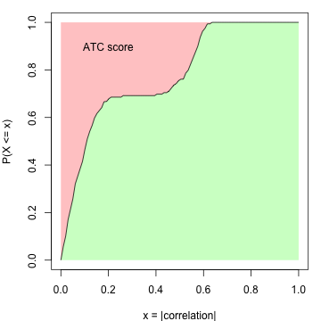
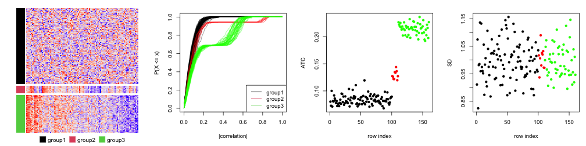
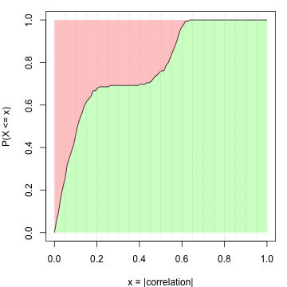
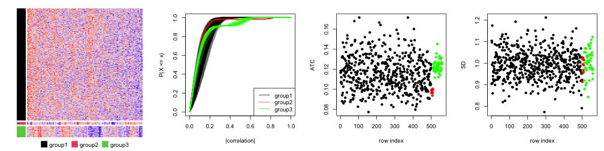
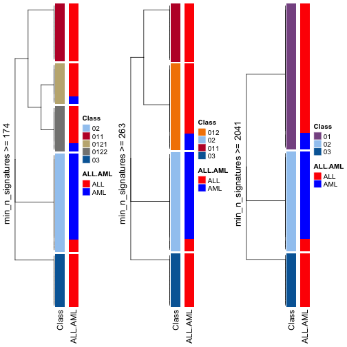
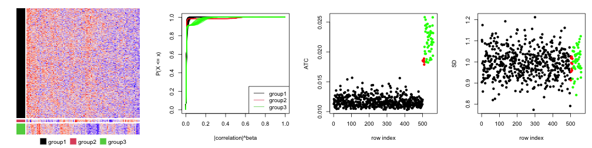
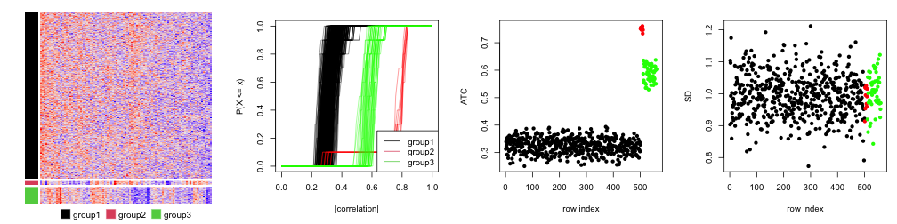

ATC - More Forms
=============================================================

**Author**: Zuguang Gu ( z.gu@dkfz.de )

**Date**: 2021-07-15

**Package version**: 1.9.3

-------------------------------------------------------------


For row $i$ in a matrix, denote the variable $X$ as a vector of absolute
values of the correlation coefficients to all other rows, evaluated at $x$,
then the ATC score for row $i$ is defined as:

$$ ATC_i = 1 - \int_0^1F_X(x)dx $$

where $F_X(x)$ is the cumulative distribution function (CDF) of $X$. 

Figure S1.1 illustrates the empirical CDF (eCDF) curve of $X$ for a certain row
$i$. The ATC score corresponds to the red area above the eCDF curve. It can be
imagined that when row $i$ correlates stronger with other rows (both
correlation and anti-correlation), the eCDF curve shifts more to the right,
thus with higher ATC scores.




A simulation test is performed to demonstrate the attributes of the ATC method. A
matrix with 160 rows, 100 columns with random values drawn from a multivariate
normal distribution is generated. The 160 rows are configured as follows:

1. 100 rows with mean of 0. The covariance matrix is set to 0 and set 1 to the
   diagonal;
2. 10 rows with mean of 0. The covariance matrix is set to 0.8 and set 1 to the
   diagonal. This simulates high correlations but in a small group of rows;
3. 50 rows with mean of 0. The covariance matrix is set to 0.5 and set 1 to the
   diagonal. This simulates intermediate correlations but in a large group of
   rows.



The first plot in Figure S1.2 is the heatmap for the random matrix, split
by the three groups of rows. In the second plot, they are eCDF curves of the
correlation of the 160 rows. The third plot is the ATC scores
for all 160 rows and the fourth plot is the standard deviation for the 160
rows. Different colors represent different row groups.

All the 160 rows have a similar variance of 1 that they cannot be distinguished
by using variance. As a contrast, the rows with non-zero covariance have
higher ATC scores (the red and green groups). The ATC scores are even higher
when the number of correlated rows increases, although the correlation value
itself is relatively small (the green group). This shows ATC method can assign
higher scores for rows which correlate to more other rows.

Since the eCDF curve monotonically increases from 0 to 1, for intervals with fixed
width, they contribute more to the ATC scores if they are close to 0 (Figure S1.3).



There can be scenarios when a huge number of rows correlate to each other but
only with very small correlation values. It results in small right-shift of
the eCDF curves for these rows, compared to the scenario where rows are
completely uncorrelated. Since the correlation values are close to zero, these
small shifts of the eCDF curves results in a relative large increase of ATC
scores.

To decrease such effect, the ATC definition can be modified to: For row $i$ in
the matrix, denote the variable $X$ as a vector of absolute values of the
correlation coefficients to all other rows, evaluated at $x$, and denote $Y = X^\beta$,
evaluated at $y$, then the ATC score for row $i$ is defined as:

$$ ATC_i = (1-\alpha) - \int_\alpha^1F_Y(y)dy $$

Where $F_Y(y)$ is the CDF of $Y$. Now $ATC_i$ is the red area above eCDF curve only on the right of 
$y =\alpha$. The coefficient $\beta$ is the power added to the absolute
correlations that it decreases more for the smaller correlations. By Default
$\alpha$ is set to 0 and $\beta$ is set to 1.

We slightly change the previous simulation test that in the first group, we
set 500 rows with pairwise correlation to 0.1, which generates 560 rows.
Similarly, there are four plots illustrated in Figure S1.4.



In Figure S1.4, we can see group 1 (the black dots), since there are quite a lot of rows, they
gain high ATC scores even when they only have tiny correlation values (compare 
to the rows in group 2, the red dots).

To remove the effect of small correlation, we can set a value larger than 0 to
$\alpha$, e.g. 0.3:



In Figure S1.5, now we see the ATC scores for rows in group 1 decrease.

We can also set $\beta$, e.g. 3, to decrease the value for rows in group 1, as shown in Figure S1.6.



## ATC with a categorical variable

In previous section, 
for row $i$ in a matrix, the variable $\mathbf{X_i}$ is a vector of absolute
values of the correlation coefficients to all other rows. When there is also a categorical
variable available, $\mathbf{X_i}$ can only contain those rows which are in the same category as row $i$.

$$ \mathbf{X_i} = \{ abs(\rho_{i, j}) | c_i = c_j, i \ne j\} $$

where $\rho_{i,j}$ is the correlation between row $i$ and row $j$. $c_i$ and $c_j$ are the category labels for row $i$ and row $j$.

An example of the application is when calculating ATC scores for the methylation dataset, the CpG sites may be in CpG islands
or CGI seas. Calculating correlation of methylation between CGIs and CGI seas may not be proper, thus, the CpG annotation (i.e.,
whether the CpG is in CGI or sea) can be provided as an additional categorical variable so that the correlations are only calculated
for the CpG sites with the same annotations.

The categorical variable can be set with the argument `group`. E.g.:


```r
ATC(m, ..., group = cgi_anno)
```

## ATC-kNN

ATC method tends to capture global correlation relationships, thus, it is able to capture, e.g. global batch effect. However, sometimes,
the real biological meaningful correlation structure only exists in a small portion of rows while not globally. If there exists a globl
batch effect, although the individual correlation is small, after accumulated by thousands of features, it leads to a large ATC score, which
hides those features which really show meaningful correlations. 

Here we provide a method ATC-kNN which only considers $k$ other rows with the most similar correlations to row $i$. You can simply set
the argument `k_neighbours`.


```r
ATC(m, ..., k_neighbours = 100)
```

The next plot uses the same simulation dataset as previous ones, but only the nearest 10 neighbours (which is the smallest number of rows in the three groups) are considered for correlating. As expected,
rows in the second group gain the highest ATC scores.



Note, in many cases, ATC is very similar as ATC-kNN. ATC-kNN shows its advantage only when the meaningful correlation structure exists in a very small
portion of rows.


