cola: A Framework for Consensus Partitioning
=============================================================

**Author**: Zuguang Gu ( z.gu@dkfz.de )

**Date**: 2021-07-14

**Package version**: 1.8.0

-------------------------------------------------------------


## Introduction

Subgroup classification is a basic task in high-throughput genomic data
analysis, especially for gene expression and DNA methylation data analysis.
Mostly, unsupervised clustering methods are applied to predict new subgroups
or to test the agreement with known annotations.

To test the stability of subgroup classifications, [consensus
clustering](https://en.wikipedia.org/wiki/Consensus_clustering) or consensus
partitioning is always performed. It clusters repeatedly with a randomly
sampled subset of data and summarizes the robustness of the clustering,
finally, it gives a consensus classification of all samples.

Here we present the *cola* package which provides a general framework for
consensus partitioning. It has the following advantages:

1. It modularizes the consensus partitioning processes that various methods can
   be easily integrated into different steps of the analysis.
2. It provides rich visualizations for interpreting the results.
3. It allows running multiple methods at the same time and provides
   functionalities to compare results in a straightforward way.
4. It provides a new method to extract features which are more efficient to
   separate subgroups.
5. It generates detailed HTML reports for the complete analysis.

Following flowchart lists the general steps of consensus partitioning
implemented by *cola*:


The steps are:

1. Clean the input matrix. The processings are: adjusting outliers, imputing
   missing values and removing rows with very small variance. This step is optional.
2. Extract a subset of rows with the highest scores. Here "scores" are calculated by
   a certain method. For gene expression analysis or methylation data
   analysis, $n$ rows with the highest variance are used in most studies, where the
   "method", or let's call it **"the top-value method"** is the variance (by
   `var()` or `sd()`). Note the choice of "the top-value method" can be general. It can be e.g. MAD (median absolute deviation) or any user-defined
   method.
3. Scale the rows in the sub-matrix (e.g. gene expression) or not (e.g.
   methylation data). This step is optional.
4. Randomly sample a subset of rows or columns from the sub-matrix with probability $p$
   and perform partitioning on the columns of the matrix by a certain partitioning
   method, with trying different numbers of subgroups.
5. Repeat step 4 several times and collect all the partitions.
6. Perform consensus partitioning analysis and determine the best number of
   subgroups which give the most stable subgrouping.
7. Apply statistical tests to find rows that show a significant difference
   between the predicted subgroups. E.g. to extract subgroup-specific genes.
8. If rows in the matrix can be associated with genes, downstream analysis such
   as function enrichment analysis can be performed.

All the steps will be explained in detail in the following sections.

First, we load the *cola* package.


```r
library(cola)
```

## The input matrix

In most of the analysis tasks, the input matrix contains values of gene
expression or DNA methylation (from methylation array or whole-genome
bisulfite sequencing). If it is an expression matrix, rows correspond to
genes, and if it is a methylation matrix, rows correspond to CpG sites. For
both types of matrices, columns should always correspond to samples where
subgroups are detected. More general, the input matrix can be any
type of measurements as long as they represent in a form of a matrix, e.g. a
matrix where rows are genomic regions and values are the histone modification
intensities in the regions, measured from a ChIP-Seq experiment.

In following part of this vignette, we always call the matrix columns as
"samples".

Before performing consensus partitioning, a simple but important step is to clean the
input matrix:


```r
# code is only for demonstration
mat = adjust_matrix(mat)
```

`adjust_matrix()` does the following preprocessing:

1. Rows where more than 25% of the samples having `NA` values are removed;
2. Use `impute::impute.knn()` to impute missing data if there is any;
3. For each row in the matrix, it uses `adjust_outlier()` (also provided by
   *cola* package) to adjust outliers. Values larger than the 95^th
   percentile or less than the 5^th percentile are replaced by corresponding
   percentiles.
4. Rows with zero variance are removed.
5. Rows with variance less than 5^th percentile of all row variance (after
   removing rows with zero variance) are removed.

Some of the above steps are optional. For example, methylation matrix does not
need to be adjusted for outliers because all the methylation values are
already in a fixed data scale (0 ~ 1).

## Basic usage

`consensus_partition()` performs consensus partitioning for a single top-value
method and a single partitioning method. The major arguments for
`consensus_partition()` are:


```r
# code is only for demonstration
res = consensus_partition(mat,
    top_value_method = "MAD",
    top_n = c(1000, 2000, 3000),
    partition_method = "kmeans",
    max_k = 6,
    p_sampling = 0.8,
    partition_repeat = 50,
    anno = NULL)
```

- `mat`: a data matrix where subgroups are found by columns.
- `top_value_method`: name of the method to assign scores to
  matrix rows. Later these scores are used to order and extract rows with top
  values.
- `top_n`: number of rows with top values used for partitioning. Normally we set
  `top_n` as a vector of different numbers.
- `partition_method`: name of the method for partitioning.
- `max_k`: maximal number of subgroups to try. It will try from 2 to `max_k`.
- `p_sampling`: the fraction of the `top_n` rows to sample. The sub-matrix with
  `p_sample * top_n` rows is used for partitioning.
- `partition_repeats`: times of partitioning with randomly sampled subset of data to perform.
- `anno`: a vector or a data frame which contains known annotations of
  samples. If it is provided, it will be drawn alongside with the predicted
  subgroups in the plot generated by downstream functions and it can also be
  tested for the correspondence to predicted subgroups.

Other arguments can be found in the documentation of
`consensus_partition()`.

To get a robust result from consensus partitioning, for a specific top-value
method and a specific partitioning method, `consensus_partition()` tries
different `top_n` and different number of subgroups. We found that different
`top_n` might give different subgroups for some data sets, thus
`consensus_partition()` pools results from different `top_n` and aims to give
a general consensus subgrouping across different `top_n`. Later, we will
introduce that the bias for `top_n` on subgrouping can be visualized by
`membership_heatmap()` function.

In most cases, users might not be very sure which top-value method and which
partitioning method is best for their dataset. The helper function
`run_all_consensus_partition_methods()` is a convenient way to try multiple
top-value methods and multiple partitioning methods simultaneously to see which
combination of methods gives the best prediction of subgroups.

In `run_all_consensus_partition_methods()`, most of the arguments are the same
as in `consensus_partition()`, except `top_value_method` and
`partition_method` now accept a vector of method names and multiple cores can
be set by `cores` argument.


```r
# code is only for demonstration
rl = run_all_consensus_partition_methods(mat, 
    top_value_method = c("SD", "MAD", ...),
    partition_method = c("hclust", "kmeans", ...),
    cores = ...)
cola_report(rl, output_dir = ...)
```

There are many functions in *cola* package that can be applied to `rl` to
visualize and compare the results for all combinations of methods
simultaneously.

`cola_report()` function can be applied on `rl` to generate a HTML report for
the complete analysis, with all the plots and tables.

## Top-value methods

Top-value methods are used to assign scores to matrix rows, later the scores
are ordered and only the top $n$ rows with the highest scores are used for
consensus partitioning. The default top-value methods provided in the package
are:


```r
all_top_value_methods()
```

```
## [1] "SD"  "CV"  "MAD" "ATC"
```

These top methods are:

- `SD`: Standard deviation.
- `CV`: [Coefficient of
  variance](https://en.wikipedia.org/wiki/Coefficient_of_variation), defined
  as `sd/(mean + s0)` where `s0` is a penalty term which is the 10^th
  percentile of all row means to avoid small values dividing small values
  giving large values.
- `MAD`: [Median absolute
  deviation](https://en.wikipedia.org/wiki/Median_absolute_deviation).
- `ATC`: A new method proposed in *cola* package and it will be explained
  later in this section.

These methods can be used in consensus partitioning by providing the name to the
`top_value_method` argument in `run_all_consensus_partition_methods()` or
`consensus_partition()`.

You can register a new top-value method by `register_top_value_methods()`. The
value should be functions. For each function, it should only have one argument
which is the matrix for analysis and it must return a vector with scores for
rows. In the following example, the "max" method uses the row maximum as the row
score and we also add the "QCD" method ([quartile coefficient of
dispersion](https://en.wikipedia.org/wiki/Quartile_coefficient_of_dispersion))
as a second method here.


```r
register_top_value_methods(
    max = function(mat) matrixStats::rowMaxs(mat),
    QCD = function(mat) {
        qa = matrixStats::rowQuantiles(mat, probs = c(0.25, 0.75))
        (qa[, 2] - qa[, 1])/(qa[, 2] + qa[, 1])
    })
all_top_value_methods()
```

```
## [1] "SD"  "CV"  "MAD" "ATC" "max" "QCD"
```

By default, the consensus partitioning functions
`run_all_consensus_partition_methods()` uses all registered top-value methods,
but still, you can explicitly specify a subset of top-value methods. To remove
registered top-value methods, simply use `remove_top_value_methods()` by
providing a vector of names.


```r
remove_top_value_methods(c("max", "QCD"))
all_top_value_methods()
```

```
## [1] "SD"  "CV"  "MAD" "ATC"
```

### The ATC method

Choosing the top rows in the matrix is important for the subgroup
classification. In most cases, we extract the most variable rows which
is defined by row variance. However, sometimes it won't give you meaningful
rows which are efficient for subgroup classification. When random noise in the
data increases, e.g. for single-cell RNASeq data, the most variable genes are
too weak to detect any stable subgroups.

If we think reversely, assuming there exist stable subgroups in the data,
there must be groups of rows showing a similar pattern to support the
subgrouping, in other words, rows in the same groups should have high
correlations to each other. Thus, if we can get rows that more correlated to
others, they are more strong to form a stable subgroup for the samples.
According to this thought, we designed the ATC method (ability to correlate to other rows).

For row $i$ in a matrix, $X$ is a vector of **the absolute correlation** to all
other rows, the ATC (ability to correlate to other rows) for row $i$ is defined
as:

$$ATC_i = 1 - \int_0^1F(x)$$

where $F(x)$ is the CDF (cumulative distribution function) of $X$.

In the following plot, the line is the CDF curve. ATC is the area above the CDF
curve. It can be imagined that when row $i$ correlates with more other rows,
the CDF curve shifts more to the right, thus with higher ATC scores.

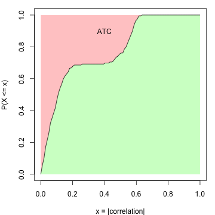

There can be scenarios when a large number of rows are correlated to each other
only with very small correlation values. They will gain high ATC value due to
a large number of rows (which corresponds to the left part of the red area
in the above plot that is close to $x = 0$). To decrease such effect, the ATC definition
can be slightly modified to:

$$ATC_i = (1 - \alpha) - \int_{\alpha}^1F(x^{\beta})$$

where now $ATC_i$ is the red area only on the right of $x = \alpha$. The
coefficient $\beta$ is the power added to the absolute correlations that it
decreases more for the smaller correlations. By Default $\alpha$ is set to 0
and $\beta$ is set to 1.

Next, we perform a simulation test to show the attributes of the ATC method. A
matrix with 160 rows, 100 columns with random values are generated as follows:

1. 100 rows with a mean of 0. The covariance matrix is set to 0 and 1 on the
   diagonal;
2. 10 rows with a mean of 0. The covariance matrix is set to 0.8 and 1 on the
   diagonal. This simulates high correlations but in a small group of rows;
3. 50 rows with a mean of 0. The covariance matrix is set to 0.5 and 1 on the
   diagonal. This simulates intermediate correlations but in a large group of
   rows.

The top left figure in following is the heatmap for the random matrix, split by the three groups
of rows. In the top right figure, they are ECDF curves of the correlation when
calculating ATC scores. The bottom left figure is the ATC scores for all 160 rows and the
bottom right figure is the standard deviation for the 160 rows.

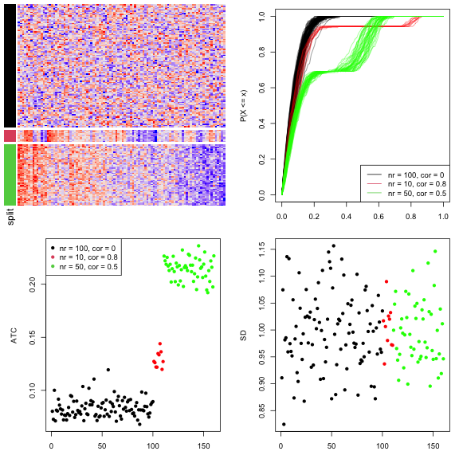

All the 160 rows have a similar variance of 1 that they cannot be distinguished
very well by using variance (bottom right figure). As a contrast, the rows
with non-zero covariance have higher ATC values (the red and green points),
even higher when the number of correlated rows increases (the green points,
although the correlation value itself is intermediate, bottom left figure). This
shows the ATC method can assign higher values for rows which correlate to more
other rows.

ATC scores are calculated by `ATC()` function. By default it uses Pearson
correlation. Users can register the ATC method with other correlation methods by,
e.g.:


```r
# code is only for demonstration
register_top_value_methods(
    ATC_spearman = function(m) ATC(m, method = "spearman"),
    ATC_bicor = function(m) ATC(m, cor_fun = WGCNA::bicor)
)
```

## Partitioning methods

Partitioning methods are used to separate samples into $k$ subgroups where $k$ is
a known parameter for the partitioning. The default partitioning methods are:


```r
all_partition_methods()
```

```
## [1] "hclust"  "kmeans"  "skmeans" "pam"     "mclust" 
## attr(,"scale_method")
## [1] "z-score" "z-score" "z-score" "z-score" "z-score"
```

These partitioning methods are:

- `hclust`: hierarchical clustering + cutree. The parameters for calling
  `hclust()` and `dist()` are all defaults for the two functions, thus it is
  Euclidean distance with "complete" clustering method.
- `kmeans`: k-means clustering.
- `skmeans`: spherical k-means clustering, from **skmeans** package.
- `pam`: partitioning around medoids, from **cluster** package.
- `mclust`: model-based clustering, from **mclust** package. The clustering is
  based on the first three principle dimensions from the original matrix.

Similarly, you can register a new partitioning method by
`register_partition_methods()`. The value should be functions with two
arguments which are the input matrix and number of subgroups. There can be a
third argument for the function which is  `...` used for passing more
arguments from `consensus_partition()`. The function should only return a
vector of subgroup/class labels or an object that can be imported by
`clue::cl_membership()`. **Please note the partition is applied on columns of
the matrix and the number of unique levels of subgroup levels which are
predicted by the partitioning method should not exceed $k$.**

Following example registers a partitioning method which randomly assigns subgroup
labels to samples:


```r
register_partition_methods(
    random = function(mat, k) {
        sample(letters[1:k], ncol(mat), replace = TRUE)
    }
)
```

Here the subgroup labels can be in any types (numbers, characters). They only
need to be different for different classes. These labels will be re-coded with
numeric indices internally (i.e. 1, 2, 3, ...).

To remove a partitioning method, use `remove_partition_methods()`:


```r
remove_partition_methods("random")
```

The built-in `hclust` method only uses Euclidean distance with "complete" clustering method,
It is easy to define another `hclust` method:


```r
# code is only for demonstration
register_partition_methods(
    hclust_cor = function(mat, k) cutree(hclust(as.dist(1 - cor(mat))), k)
)
```

Following code registers SOM and NMF partitioning methods:


```r
# code is only for demonstration
library(kohonen)
register_partition_methods(
    SOM = function(mat, k, ...) {
        kr = floor(sqrt(ncol(mat)))
        somfit = som(t(mat), grid = somgrid(kr, kr, "hexagonal"), ...)
        m = somfit$codes[[1]]
        m = m[seq_len(nrow(m)) %in% somfit$unit.classif, ]
        cl = cutree(hclust(dist(m)), k)
        group = numeric(ncol(mat))
        for(cl_unique in unique(cl)) {
            ind = as.numeric(gsub("V", "", names(cl)[which(cl == cl_unique)]))
            l = somfit$unit.classif %in% ind
            group[l] = cl_unique
        }
        group
    }
)
library(NMF)
register_partition_methods(
    NMF = function(mat, k, ...) {
        fit = nmf(mat, rank = k, ...)
        apply(fit@fit@H, 2, which.max)
    }, scale_method = "max-min"
)
```

For these two methods, users can simply use `register_SOM()` and
`register_NMF()` functions in *cola* package. 


```r
# code is only for demonstration
register_SOM()
register_NMF()
```

In the code above, there is an additional argument `scale_method` for
`register_partition_method()`. `scale_method` controls how to scale the matrix
rows before partitioning if scaling is turned on `consensus_partition()` or
`run_all_consensus_partition_methods()`. There are three possible values:

- `z-score`: z-score transformation, which is `(x - mean(x))/sd(x)`.
- `max-min`: `(x - min(x))/(max(x) - min(x))`, this ensures all the scaled
  values are non-negative.
- `none`: no scaling is performed.

### The skmeans method

The skmeans method ([the spherical k-means
clustering](https://www.jstatsoft.org/article/view/v050i10)) is powerful to
detect subgroups where samples in the same subgroup show strong correlations.
skmeans clustering uses cosine similarity and projects data points onto a unit
hyper-sphere. As we have tested for many datasets, skmeans is very efficient
to detect stable subgroups.


## Consensus partitioning

For a given number of top rows $n_i$, the corresponding matrix with top rows
denoted as $M_i$, a subset of rows with a probability of $p$ are randomly
sampled from $M_i$ and a certain partitioning method is applied to it, generating
a partition $P_a$. In most cases, we have no prior knowledge of which $n_i$
gives better results, thus, *cola* allows to try multiple $n_i$ and pool
partitions from all $n_i$ together to find a consensus subgrouping, which also
lets rows more on the top of the ranked list give higher weight for
determining the final subgroups. Let's assume top rows are tried for $n_1$,
$n_2$, ..., $n_m$ and the randomly sampling is performed for $N_s$ times,
then, for a given number of subgroups $k$ for trying, the total number of
partitions is $N_P = m \times N_s$.

### Consensus matrix

The consensus matrix measures how consistent two samples are in the same
subgroup and it can be used to visualize or analysis the stability of the
subgrouping. The value $c_{ij}$ in the consensus matrix is the probability of
sample $i$ and sample $j$ in the same subgroup in all $N_P$ partitions. It is
calculated as:

$$c_{ij} = \sum_a^{N_P}I(s_{ia}, s_{ja})/N_P$$

where $s_{ia}$ is the subgroup label for sample $i$ in partition $a$ and $I()$
is the indicator function there $I(x = y) = 1$ and $I(x \neq y) = 0$.

Assuming there are stable subgroups in a dataset, which means, for any pair of
samples $i$ and $j$ both in a same subgroup, $c_{ij}$ is close to 1, and for
any pairs in different subgroups, $c_{ij}$ is close to 0, if the consensus
matrix is visualized as a heatmap, samples in the same subgroup will be
represented as a block in the diagonal of the heatmap.

Following two heatmaps visualize two consensus matrices. The left one shows
less stability of subgrouping than the right one, while for the right one,
there are three very obvious blocks in the diagonal that in each block, the
corresponding samples are very likely to be in the same subgroup.

In the following two heatmaps, the right one corresponds to a more stable
subgrouping.

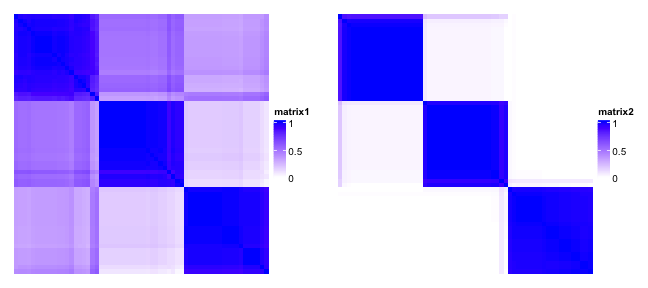

### Consensus subgroup labels

As long as we have a list of $N_P$ partitions for a given subgroup number $k$,
we need to find a consensus partition based on all $N_P$
partitions.Internally, *cola* package uses the **clue** package to construct
the "partition ensemble" and predict the consensus subgroups. The "SE" method
from `clue::cl_consensus()` function (please check the on-line documentation
of this function) are used to calculate the consensus subgroup labels. The
consensus subgroups are labels by integers (i.e. 1, 2, 3, ...).

### Adjust subgroup labels

The subgroup labels are assigned with numeric indices, however, in
each partition, the assignment of the labels can be random, e.g. one same
subgroup can be assigned with 1 in one partition, while in the other
partition, it can be 2, but they are all identical for the sense of
subgrouping. E.g. following partitions are all identical:

```
1 1 1 1 1 1 1 2 2 2 2 2 2
2 2 2 2 2 2 2 1 1 1 1 1 1
a a a a a a a b b b b b b
```

The subgroups are identical if switching the subgroup labels. This subgroup
label adjustment is called [the linear sum assignment
problem](https://en.wikipedia.org/wiki/Assignment_problem), which is solved by
the `solve_LSAP()` function in **clue** package. The aim is to find a mapping
$m()$ between two sets of labels to maximize $\sum_i I(s_{1i}, m(s_{2i}))$
where $s_1$ is the first label set and $s_2$ is the second label set.

In following example, if the mapping is `1 -> 2, 2 -> 1`, the second partition
in following

```
1 1 1 1 1 1 1 2 2 2 2 2 # in partition 1
2 2 2 2 2 1 1 1 1 1 1 1 # in partition 2
```

is adjusted to

```
1 1 1 1 1 1 1 2 2 2 2 2
1 1 1 1 1 2 2 2 2 2 2 2 # switch 1 <-> 2
```

For the subgroups predicted by `clue::cl_consensus()`, the labels are
additionally adjusted by the mean distance in each subgroup (calculated from
the scaled data matrix), which means, the subgroup with label 1 always has the
smallest mean intra-group distance.

**This subgroup label adjustment is frequently used in *cola* to help the
visualization as well as downstream analysis. E.g. for a specific combination
of top-value method and partitioning method, the subgroup labels for different
k are adjusted, and for the subgroups from different top-value methods and
partitioning methods, the subgroup labels are also adjusted to make the label
difference from different methods minimal.**

### Membership matrix 

The $N_P$ partitions are stored as a membership matrix where rows are
partitions (grouped by `top_n`) and the subgroup labels in each partition are
adjusted according to the consensus partition. Following heatmap is a
visualization of all partitions and correspondence to the consensus partition
for $k = 2$. The `p*` annotation on top of the heatmap is the probability of
being in subgroup $i$ across all partitions.

In the following plot, actually we can see the samples in the middle tend to
belong to the green subgroup (the group with label 1) for small `top_n` (e.g.
`top_n = 1000`), while, when `top_n` increases, they go to the red subgroup
(group label 2). Since the final subgroups are summarized from all `top_n`,
the probabilities of the middle samples to be in either subgroup are
close, which can also be observed from the probability annotation (`p*`
annotations). This might indicate these are the subset of samples which are in
the intermediate state between group 1 and group 2.


## Determine the best number of subgroups

Consensus partitioning is applied with a specific number of subgroups (we term
it as $k$). Normally, a list of $k$ are tried to find the best $k$. *cola*
provides metrics to help to determine the best number of subgroups.

The `get_stats()` function returns statistics for all metrics mentioned below
and `select_partition_number()` plots the statistics with the number of
subgroups (an example is [here](#toc_25)).

### Silhouette score

[The silhouette
scores](https://en.wikipedia.org/wiki/Silhouette_%28clustering%29) measures
how close one sample is in its own subgroup compared to the closest
neighbouring subgroup. For sample $i$, the mean distance to every subgroups
are calculated, denoted as $d_1$, $d_2$, ..., $d_k$ ($d_k$ is the mean
Euclidean distance between sample $i$ and every sample in subgroup $s$). The
distance to the subgroup where sample $i$ stays is denoted as $d_a$ and the
silhouette score is defined as:

$$silhouette_i = 1 - d_a/d_b$$

where $d_b$ is the minimal distance excluding $d_a$:

$$d_b = min_{j \neq a}^k d_j$$

Following plot illustrates how silhouette score is calculated for sample `x_i`.

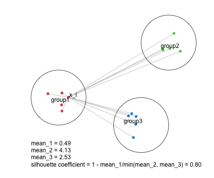

The mean silhouette score from all samples is used to choose the best $k$ where
higher the mean silhouette score, better the $k$.

### PAC score

[The PAC score](https://en.wikipedia.org/wiki/Consensus_clustering#Over-interpretation_potential_of_consensus_clustering) measures the proportion of
the ambiguous subgrouping. If the subgrouping is stable, in $N_P$ partitions,
sample $i$ and sample $j$, in most of the cases, are either always in the same
subgroup, or always in different subgroups, which results in that, in the
consensus matrix, the values are, in most cases, close to 1 or 0. Then
in the CDF of the consensus matrix, the curve will be very flattened between
$x_1$ and $x_2$ where $x_1$ is very close to 0 and $x_2$ is very close to 1
because there are very few values between $x_1$ and $x_2$. Thus, the proportion of 
sample pairs with consensus values in $(x_1, x_2)$ is called **the proportion of
the ambiguous clustering**, which can be calculated by $F(x_2) - F(x_1)$.

In the following plots, the red line in the left plot corresponds to the first
consensus heatmap and the blue line corresponds to the second consensus
heatmap that is more stable than the first one. It is quite obvious to see the
second consensus heatmap has far less PAC value than the first one.

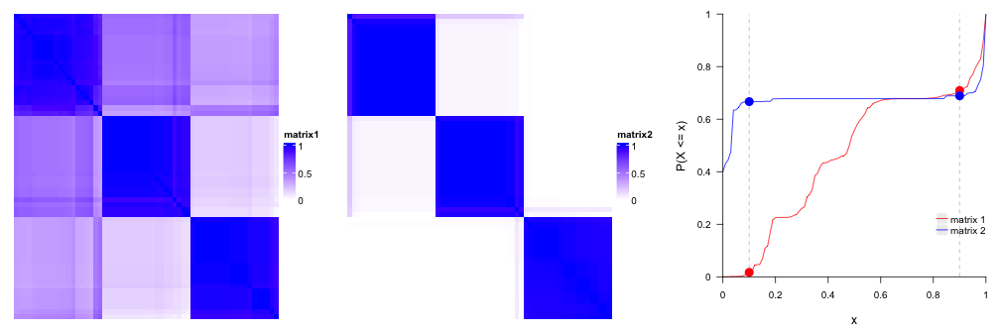

In some cases, $F(x_1)$ or $F(x_2)$ changes a lot when $x_1$ has slight change around 0.1,
or $x_2$ has slight change around 0.9. Thus, to make PAC not so sensitive to the selection of $x_1$ and $x_2$, 
PAC value is calculated by removing 5% samples with lowest silhouette scores.

Smaller the PAC score, better the $k$.

### Concordance

The concordance of partitions to the consensus partition is calculated as, for
each partition $P_a$, the probability that it fits the consensus partition:

$$c_{a} = \frac{1}{N_s}\sum_i^{N_s}I(s_{ia} = sc_i)$$

where $N_s$ is the number of samples, $s_{ia}$ is the subgroup label of sample
$i$ in partition $a$ and $sc_i$ is the consensus subgroup label for sample
$i$. Note class labels in single partitions have already been adjusted to the
consensus partition labels.

The final concordance score is the mean value of $c_a$. Higher the concordance
score, better the $k$.

### Area increased 

It is the increased area under CDF of the consensus matrix compared to the
previous $k$.

$$A_k = \int F_k(x) - \int F_{k-1}(x)$$

and when $k = 2$ or for the minimal $k$:

$$A_k = \int F_k(x)$$

In follow example, there are five consensus heatmaps corresponding to $k =2,3,4,5,6$. 
Note the number of subgroups that can be inferred from the
consensus heatmap is not necessary to be exactly the same as $k$. It can be
smaller than $k$.

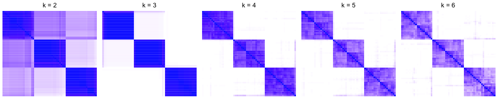

The corresponding CDF curves and the area increased are:

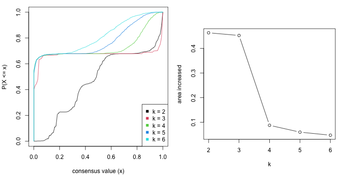

The $k$ before the elbow is taken as the best $k$ (in the above example it is 3).
Basically when $k$ reaches a stable subgrouping, increasing $k$ won't change
the consensus matrix too much, which results in less change of the difference of
The area under the CDF curve.

### Rand index 

In some cases, when the number of subgroups changes from $k-1$ to $k$, all the
statistics imply $k$ is a better choice than $k-1$. However, when observing
the consensus heatmap, basically it is because a very small set of samples are
separated to form a new subgroup. In this case, it is better to still keep
$k-1$ subgroups. In other words, the subgrouping with $k$ is similar to
$k-1$ and it is not worth to increase $k$ from $k-1$. In *cola* package,
there are two metrics: the Rand index and Jaccard index to measure the similarity
of two partitions for $k-1$ and $k$. The two metrics are calculated by
`clue::cl_agreement(..., method = "Rand")` and `clue::cl_agreement(..., method
= "Jaccard")`.

For all pairs of samples, denote following symbols
(https://en.wikipedia.org/wiki/Rand_index#Definition):

- $a$: the number of pairs of samples that are in the same subgroup in $k$ and
  in the same subgroup in $k-1$.
- $b$: the number of pairs of samples that are in the different subgroup in
  $k$ and in the different subgroup in $k-1$.
- $c$: the number of pairs of samples that are in the same subgroup in $k$ and
  in the different subgroup in $k-1$.
- $d$: the number of pairs of samples that are in the different subgroup in
  $k$ and in the same subgroup in $k-1$.

the Rand index which is the percent of pairs of samples that are both in a
same cluster or both are not in the same cluster in the partition of $k$ and $k-1$.

$$Rand = \frac{a+b}{a+b+c+d}$$

If Rand index is too high, it means the two subgroupings are very similar and
it is not sufficient to increase from $k-1$ to $k$.

### Jaccard index

The Jaccard index is the ratio of pairs of samples that are both in a same subgroup
in the partition of $k$ and $k-1$ and the pairs of samples are both in the same
subgroup in the partition of $k$ or $k-1$.

$$Jaccard = \frac{a}{a+c+d}$$

In the following plots, when the number of subgroups increases from 3 to 4, there is only
one single sample separated from other subgroups to form a new subgroup. The Rand index or
the Jaccard index for $k=4$ is close to 1, which means, the subgroups at $k=4$ are
highly similar as $k=3$, thus we ignore $k=4$ and take $k=3$ as the better subgrouping.


### Rule

*cola* provides a `suggest_best_k()` function which suggests the best $k$.
It is based on the following rules:

- All $k$ with Jaccard index larger than 0.95 are removed because increasing
  $k$ does not provide enough extra information. If all $k$ are removed, it is
  marked as no subgroup is detected.
- For all $k$ with 1-PAC score larger than 0.9, the maximal $k$ is taken as
  the best $k$, and other $k$ are marked as optional $k$.
- If it does not fit the second rule. The $k$ with the maximal vote of the
  highest 1-PAC score, highest mean silhouette, and highest concordance is
  taken as the best $k$.

`suggest_best_k()` only gives suggestion on selecting a reasonable $k$.
Users still need to look at the plots (e.g. by `select_partition_number()` or
`consensus_heatmap()` functions), or even by checking whether the subgrouping
gives reasonable signatures by `get_signatures()`, to pick a reasonable $k$ that
best explains their studies.

## Find signatures

As long as there are stable subgroups, we can look for rows which show
A distinct difference in one subgroup compared to others. They can be called
signature genes or signature CpG sites if the corresponding dataset is gene
expression data or methylation data.

By default, samples with silhouette scores less than 0.5 are removed. *cola*
provides the following methods:

- `Ftest` use F-test to find significantly different rows between subgroups.
- `ttest`: First it looks for the subgroup with the highest mean value, compare to
  each of the other subgroups with t-test and take the maximum p-value. Second
  it looks for the subgroup with lowest mean value, compare to each of the
  other subgroups again with t-test and take the maximum p-values. Later for
  these two lists of p-values take the minimal p-value as the final p-value.
- `samr` and `pamr`: use
  [SAM](https://CRAN.R-project.org/package=samr)/[PAM](https://CRAN.R-project.org/package=pamr)
  method to find significantly different rows between subgroups.
- `one_vs_others` For each subgroup $i$ in each row, it uses t-test to compare samples in current 
       subgroup to all other samples, denoted as $p_i$. The p-value for current row is selected as $min(p_i)$.
- `uniquely_high_in_one_group` The signatures are defined as, if they are uniquely 
    up-regulated in subgroup A, then it must fit followingcriterions: 1. in a two-group t-test of A ~ other_merged_groups, 
    the statistic must be > 0 (high in group A) and p-value must be significant, 
    and 2. for other groups (excluding A), t-test in every pair of groups should not be significant.


Users can also provide their own method by providing a function with the
matrix and subgroup labels as inputs and a vector of FDR as output.

## Functional Enrichment

If the matrix rows can correspond to genes (e.g. the gene expression matrix,
or the methylation array data where CpG sites can be annotated to the
transcription start site of genes), *cola* performs functional enrichment by
`functional_enrichment()` function with hypergeometric test to the signatures
by *ClusterProfiler*, *DOSE* or *ReactomePA* packages. k-means clustering with
automatically selecting the number of groups of the signature is performed and
functional enrichment is applied to each row signature group, to the fact that
there may exist different expression patterns and genes involved may play
different functional roles.

More details on functional enrichment analysis can be found in the vignette
["Automatic Functional Enrichment on Signature
Genes"](functional_enrichment.html).

## Compare multiple methods

`consensus_partition()` is the core function for consensus partitioning. But
it can only perform analysis with a single top-value method and a single
partitioning method. In most cases, we have no idea of which combination of
top-value method and partitioning method gives better results. Here
`run_all_consensus_partition_methods()` can perform analysis with multiple
methods simultaneously:


```r
# code is only for demonstration
rl = run_all_consensus_partition_methods(mat, 
    top_value_method = c("SD", "MAD", ...),
    partition_method = c("hclust", "kmeans", ...),
    cores = ...)
```

By default it runs analysis for all combinations of top-value methods in
`all_top_value_methods()` and partitioning methods in `all_partition_methods()`.

*cola* package provides functions to collect plots from all combinations of
methods for straightforward comparisons.


```r
# code is only for demonstration
collect_plots(rl, fun = consensus_heatmap, k = ...)
collect_plots(rl, fun = membership_heatmap, k = ...)
collect_plots(rl, fun = get_signatures, k = ...)
```

And `collect_classes()` compares consensus partition from all methods:


```r
# code is only for demonstration
collect_classes(rl, k = ...)
```

The plots from `collect_plots()` and `collect_classes()` can be found [here](#toc_27).

## Implementation of the package

*cola* is implemented in an object-oriented way. There are two main classes
where `ConsensusPartition` class contains results for a single top-value method
and a single partitioning method, while `ConsensusPartitionList` class contains results for
multiple top-value methods and multiple partitioning methods.

In the following example code, we use the analysis on Golub dataset. The more information
of how to generate `golub_cola` can be find by `?golub_cola`.


```r
data(golub_cola)
```

Simply entering the variable name gives you the summary of the analysis and a
list of functions that can be applied to this object:


```r
golub_cola
```

```
## A 'ConsensusPartitionList' object with 20 methods.
##   On a matrix with 4116 rows and 72 columns.
##   Top rows are extracted by 'SD, CV, MAD, ATC' methods.
##   Subgroups are detected by 'hclust, kmeans, skmeans, pam, mclust' method.
##   Number of partitions are tried for k = 2, 3, 4, 5, 6.
##   Performed in total 15000 partitions by row resampling.
## 
## Following methods can be applied to this 'ConsensusPartitionList' object:
##  [1] "cola_report"           "collect_classes"       "collect_plots"         "collect_stats"        
##  [5] "colnames"              "functional_enrichment" "get_anno"              "get_anno_col"         
##  [9] "get_classes"           "get_matrix"            "get_membership"        "get_stats"            
## [13] "is_best_k"             "is_stable_k"           "ncol"                  "nrow"                 
## [17] "rownames"              "show"                  "suggest_best_k"        "test_to_known_factors"
## [21] "top_rows_heatmap"      "top_rows_overlap"     
## 
## You can get result for a single method by, e.g. object["SD", "hclust"] or object["SD:hclust"]
## or a subset of methods by object[c("SD", "CV")], c("hclust", "kmeans")]
```

To get results for a single top-value method and partitioning method, you can subset `golub_cola`
by the name of the combination of the methods.


```r
golub_cola["ATC:skmeans"]
```

```
## A 'ConsensusPartition' object with k = 2, 3, 4, 5, 6.
##   On a matrix with 4116 rows and 72 columns.
##   Top rows (412, 824, 1235) are extracted by 'ATC' method.
##   Subgroups are detected by 'skmeans' method.
##   Performed in total 750 partitions by row resampling.
##   Best k for subgroups seems to be 3.
## 
## Following methods can be applied to this 'ConsensusPartition' object:
##  [1] "cola_report"             "collect_classes"         "collect_plots"          
##  [4] "collect_stats"           "colnames"                "compare_partitions"     
##  [7] "compare_signatures"      "consensus_heatmap"       "dimension_reduction"    
## [10] "functional_enrichment"   "get_anno"                "get_anno_col"           
## [13] "get_classes"             "get_consensus"           "get_matrix"             
## [16] "get_membership"          "get_param"               "get_signatures"         
## [19] "get_stats"               "is_best_k"               "is_stable_k"            
## [22] "membership_heatmap"      "ncol"                    "nrow"                   
## [25] "plot_ecdf"               "predict_classes"         "rownames"               
## [28] "select_partition_number" "show"                    "suggest_best_k"         
## [31] "test_to_known_factors"   "top_rows_heatmap"
```

Functions on `ConsensusPartitionList` class that are important to use are:

- `cola_report()`: Generate a HTML report for the complete analysis.
- `collect_classes()`: Plots consensus partition for every combination of methods. On top there is a 
    global consensus partition summarized from all single-method-level partitions, weighted by the mean
    silhoutte scores.
- `collect_plots()`: Collect plots for all methods.
- `get_classes()`: The global consensus subgroup by taking subgroups from all methods together.
- `get_stats()`: Extract the statistics for determining the best number of subgroups.
- `suggest_best_k()`: Guess the best $k$ for each method.
- `test_to_known_factors()`: Apply tests to the annotations if provides. The test will be Chi-squared test or ANOVA depending on the data type of the annotation.
- `top_rows_heatmap()`: Make heatmaps for `top_n` rows under different top-value methods.
- `top_rows_overlap()`: Make Venn-Euler diagram for the `top_n` rows under different top-value methods.
- `functional_enrichment()`: If rows can be associated to genes, it applies functional enrichment analysis.

Functions on `ConsensusPartition` class:

- `collect_classes()`: Make heatmaps for the consensus subgroups from all $k$.
- `collect_plots()`: Collect all plots for consensus heatmaps, membership heatmaps and signature heatmaps for all $k$.
- `consensus_heatmap()`: Make consensus heatmap.
- `dimension_reduction()`: Make PCA/MDS/UMAP/t-SNE plot.
- `get_classes()`: Get class labels for a specific $k$.
- `get_consensus()`: Get the consensus matrix for a specific $k$.
- `get_signatures()`: Make the heatmap for the signatures. 
- `compare_signatures()`: Compare signatures for different k.
- `get_stats()`: Extract the statistics for determining best number of subgroups.
- `suggest_best_k()`: Guess the best $k$.
- `membership_heatmap()`: Make the membership heatmap.
- `plot_ecdf()`: Plot the emperical CDF of the consensus matrix for all $k$.
- `select_partition_number()`: Make plots for all statistics for determining the best $k$.
- `test_to_known_factors()`: Apply tests to the annotations if provides. The test will be Fisher's exact test or ANOVA depending on the data type of the annotation.
- `functional_enrichment()`: If rows can be associated to genes, it applies functional enrichment analysis.
- `predict_classes()`: Predict classes of new samples.

## Visualizations

*cola* package provides rich visualizations for the results generated by a
single method or multiple methods.

### On the ConsensusPartition object

The object which is generated with a single top-value method and a single
partitioning method belongs to the class `ConsensusPartition`. There are several
visualization functions that can be applied to it.
 `select_partition_number()` makes several plots to show
different statistics along with different $k$, which helps to determine the
"best k".


```r
res = golub_cola["ATC:skmeans"] # the ConsensusPartition object
select_partition_number(res)
```

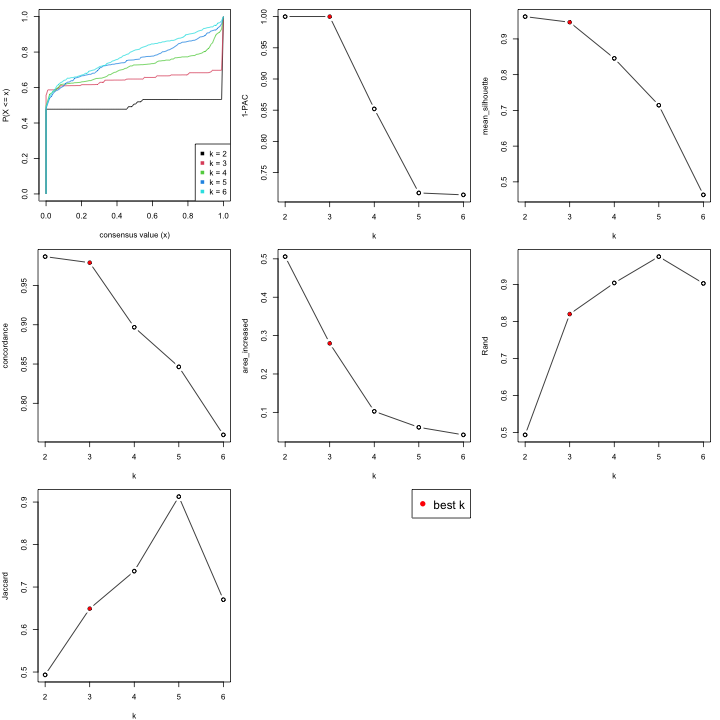

The heatmap for the consensus matrix with a certain $k$:


```r
consensus_heatmap(res, k = 3)
```

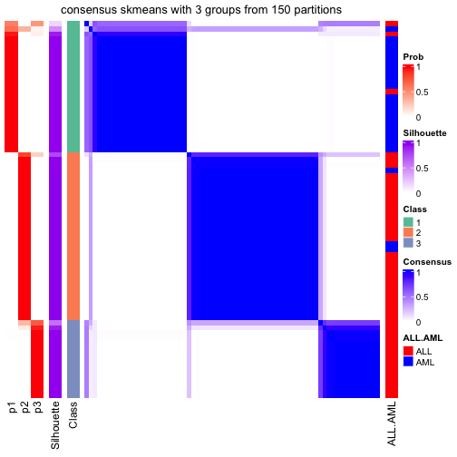

The heatmap for the membership matrix with a certain $k$:


```r
membership_heatmap(res, k = 3)
```

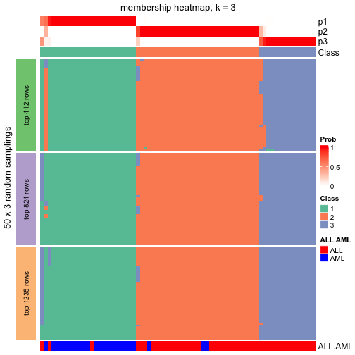

The dimension reduction plot with a certain $k$:


```r
dimension_reduction(res, k = 3)
```

```
## use UMAP
```

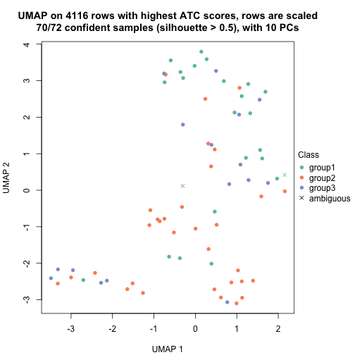

The heatmap for the signature rows with a certain $k$. The heatmap is split
into two parts by columns. The left heatmap where the barplots on top are in
black contains samples with silhouette scores larger than 0.5 and the right
heatmap where the barplot son top are in grey contains samples with silhouette
scores less than 0.5. Rows are automatically split by k-means. 


```r
get_signatures(res, k = 3)
```

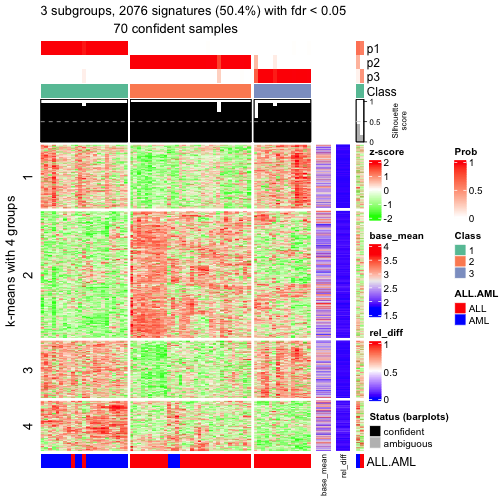

`fdr_cutoff` and `top_signatures` arguments control the number of signatures shown
in the heatmap.


```r
get_signatures(res, k = 3, top_signatures = 100)
```

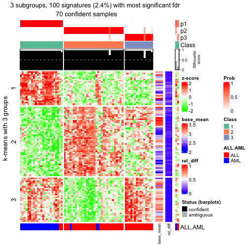

`collect_classes()` which is applied on the `ConsensusPartition` object
visualizes how subgroups are corresponded with increasing $k$. The same row in 
all heatmaps corresponds to a same sample.


```r
collect_classes(res)
```

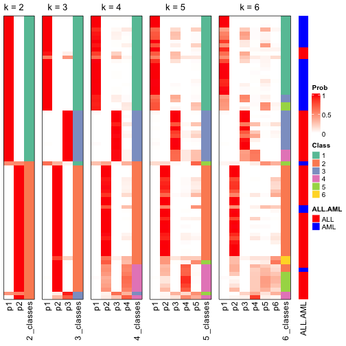

`collect_plots()` which is applied on the `ConsensusPartition` object puts
all the plots from all $k$ into one single page.


```r
collect_plots(res)
```

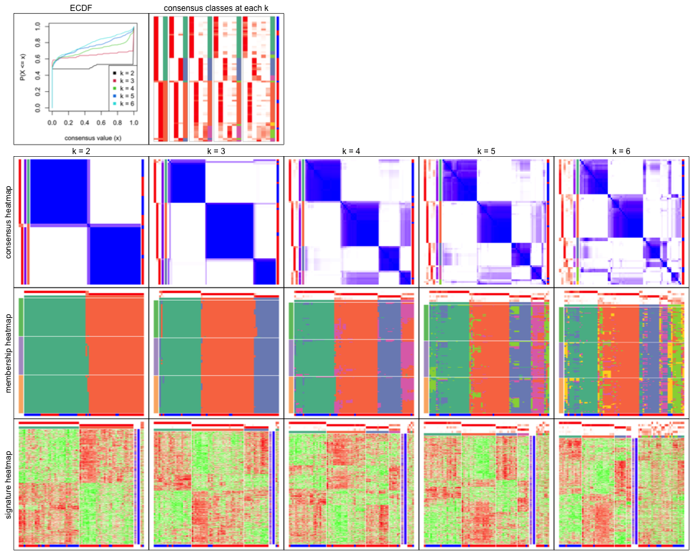

### On the ConsensusPartitionList object

`run_all_consensus_partition_methods()` returns a `ConsensusPartitionList` object.
There are two main functions which can visualize results from all combinations
of methods and compare directly.


```r
collect_plots(golub_cola, fun = consensus_heatmap, k = 3)
```

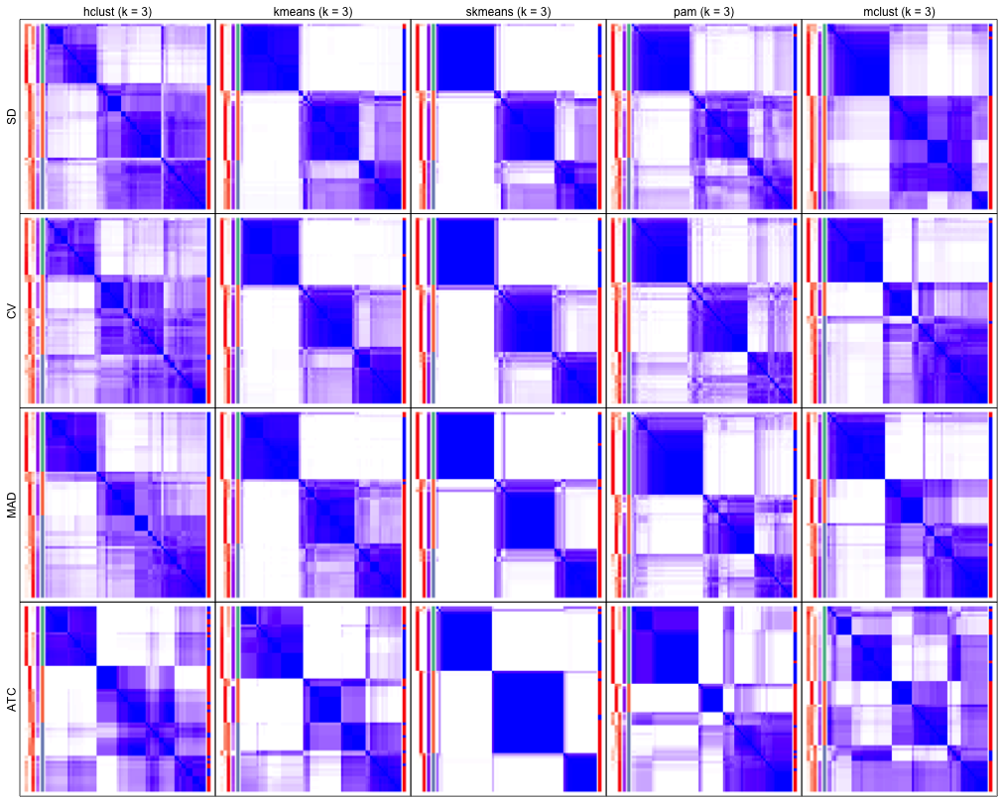

`fun` can also be `membership_heatmap` or `get_signatures` that membership heatmap
and signature heatmap for each method will be plotted.

`collect_classes()` which is applied on the `ConsensusPartitionList` object plots 
the partition for each combination of methods and the lightness correspond to the 
silhouette scores for samples in each method. Rows are clustered by the dissimilarity
measurement from `clue::cl_dissimilarity(..., method = "comembership")`. On top the
consensus subgroup is inferred from all methods by taking the mean silhouette scores
as weight.


```r
collect_classes(golub_cola, k = 3)
```

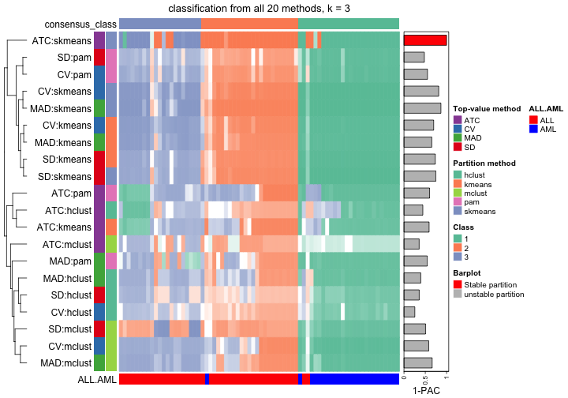

`collect_stats()` helps to compare statistics from multiple methods and multiple metrics.


```r
collect_stats(golub_cola, k = 3)
```

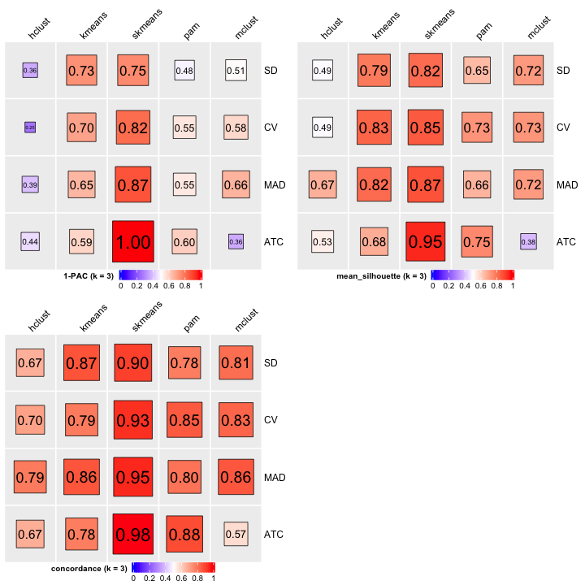

## The HTML report

All the content introduced above is mainly for the deep understanding of the
package. In real data analysis, users do not need to type that amount of code.
`cola_report()` function wraps all the code and performs the complete analysis
automatically. Normally, applying *cola* analysis, following three lines of
code are enough for you.


```r
# code is only for demonstration
mat = adjust_matrix(mat) # for some datasets, you don't need this line.
rl = run_all_consensus_partition_methods(mat, cores = ...)
cola_report(rl, output_dir = ...) # Alles ist da!
```

## Real-world examples

More examples for *cola* analysis can be found at https://jokergoo.github.io/cola_collection/.

## Session info


```r
sessionInfo()
```

```
## R version 4.1.0 (2021-05-18)
## Platform: x86_64-apple-darwin17.0 (64-bit)
## Running under: macOS Big Sur 10.16
## 
## Matrix products: default
## BLAS:   /Library/Frameworks/R.framework/Versions/4.1/Resources/lib/libRblas.dylib
## LAPACK: /Library/Frameworks/R.framework/Versions/4.1/Resources/lib/libRlapack.dylib
## 
## locale:
## [1] C/UTF-8/C/C/C/C
## 
## attached base packages:
##  [1] parallel  stats4    grid      stats     graphics  grDevices utils     datasets  methods  
## [10] base     
## 
## other attached packages:
##  [1] hu6800.db_3.13.0     org.Hs.eg.db_3.13.0  AnnotationDbi_1.54.1 IRanges_2.26.0      
##  [5] S4Vectors_0.30.0     Biobase_2.52.0       BiocGenerics_0.38.0  GetoptLong_1.0.5    
##  [9] mvtnorm_1.1-2        matrixStats_0.59.0   circlize_0.4.13      ComplexHeatmap_2.8.0
## [13] cola_1.8.0           markdown_1.1         knitr_1.33           BiocManager_1.30.16 
## [17] colorout_1.2-2      
## 
## loaded via a namespace (and not attached):
##  [1] colorspace_2.0-2       rjson_0.2.20           ellipsis_0.3.2         mclust_5.4.7          
##  [5] XVector_0.32.0         GlobalOptions_0.1.2    clue_0.3-59            bit64_4.0.5           
##  [9] RSpectra_0.16-0        fansi_0.5.0            xml2_1.3.2             codetools_0.2-18      
## [13] splines_4.1.0          doParallel_1.0.16      cachem_1.0.5           impute_1.66.0         
## [17] polyclip_1.10-0        jsonlite_1.7.2         Cairo_1.5-12.2         umap_0.2.7.0          
## [21] annotate_1.70.0        cluster_2.1.2          png_0.1-7              data.tree_1.0.0       
## [25] compiler_4.1.0         httr_1.4.2             assertthat_0.2.1       Matrix_1.3-4          
## [29] fastmap_1.1.0          tools_4.1.0            gtable_0.3.0           glue_1.4.2            
## [33] GenomeInfoDbData_1.2.6 dplyr_1.0.7            Rcpp_1.0.6             slam_0.1-48           
## [37] eulerr_6.1.0           vctrs_0.3.8            Biostrings_2.60.1      iterators_1.0.13      
## [41] polylabelr_0.2.0       xfun_0.24              stringr_1.4.0          mime_0.11             
## [45] lifecycle_1.0.0        irlba_2.3.3            XML_3.99-0.6           dendextend_1.15.1     
## [49] zlibbioc_1.38.0        scales_1.1.1           microbenchmark_1.4-7   RColorBrewer_1.1-2    
## [53] gridExtra_2.3          memoise_2.0.0          reticulate_1.20        ggplot2_3.3.5         
## [57] stringi_1.6.2          RSQLite_2.2.7          highr_0.9              genefilter_1.74.0     
## [61] foreach_1.5.1          shape_1.4.6            GenomeInfoDb_1.28.0    rlang_0.4.11          
## [65] pkgconfig_2.0.3        bitops_1.0-7           evaluate_0.14          lattice_0.20-44       
## [69] purrr_0.3.4            bit_4.0.4              tidyselect_1.1.1       magrittr_2.0.1        
## [73] R6_2.5.0               magick_2.7.2           generics_0.1.0         DBI_1.1.1             
## [77] pillar_1.6.1           survival_3.2-11        KEGGREST_1.32.0        RCurl_1.98-1.3        
## [81] tibble_3.1.2           crayon_1.4.1           utf8_1.2.1             viridis_0.6.1         
## [85] skmeans_0.2-13         blob_1.2.1             digest_0.6.27          xtable_1.8-4          
## [89] brew_1.0-6             openssl_1.4.4          munsell_0.5.0          viridisLite_0.4.0     
## [93] askpass_1.1
```


