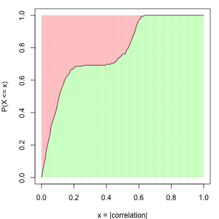

Automatic Functional Enrichment on Signature Genes
=============================================================

**Author**: Zuguang Gu ( z.gu@dkfz.de )

**Date**: 2021-07-14

**Package version**: 1.8.0

-------------------------------------------------------------


If the matrix rows can correspond to genes (e.g. the gene expression matrix,
or the methylation array data where CpG sites can be annotated to the
transcription start site of genes), *cola* performs functional enrichment by
the `functional_enrichment()` function to the signatures by
[*ClusterProfiler*](https://bioconductor.org/packages/clusterProfiler/),
[*DOSE*](https://bioconductor.org/packages/DOSE/) or
[*ReactomePA*](https://bioconductor.org/packages/ReactomePA/) packages.

## The first example

We first demonstrate the usage of `functional_enrichment()` function by the
TCGA GBM dataset. In following example code, `TCGA_GBM_subgroup.rds` is
generated by the code demonstrated
[here](https://jokergoo.github.io/cola_examples/TCGA_GBM/). We download the
result file that has already been generated.


```r
download.file("https://jokergoo.github.io/cola_examples/TCGA_GBM/TCGA_GBM_subgroup.rds", 
    destfile = "TCGA_GBM_subgroup.rds", quiet = TRUE)
rl = readRDS("TCGA_GBM_subgroup.rds")
file.remove("TCGA_GBM_subgroup.rds")
```


We select result from a single method `ATC:skmeans`:


```r
library(cola)
res = rl["ATC:skmeans"]
res
```

```
## A 'ConsensusPartition' object with k = 2, 3, 4, 5, 6.
##   On a matrix with 11268 rows and 173 columns.
##   Top rows (1000, 2000, 3000, 4000, 5000) are extracted by 'ATC' method.
##   Subgroups are detected by 'skmeans' method.
##   Performed in total 1250 partitions by row resampling.
##   Best k for subgroups seems to be 4.
## 
## Following methods can be applied to this 'ConsensusPartition' object:
##  [1] "cola_report"             "collect_classes"         "collect_plots"          
##  [4] "collect_stats"           "colnames"                "compare_partitions"     
##  [7] "compare_signatures"      "consensus_heatmap"       "dimension_reduction"    
## [10] "functional_enrichment"   "get_anno"                "get_anno_col"           
## [13] "get_classes"             "get_consensus"           "get_matrix"             
## [16] "get_membership"          "get_param"               "get_signatures"         
## [19] "get_stats"               "is_best_k"               "is_stable_k"            
## [22] "membership_heatmap"      "ncol"                    "nrow"                   
## [25] "plot_ecdf"               "predict_classes"         "rownames"               
## [28] "select_partition_number" "show"                    "suggest_best_k"         
## [31] "test_to_known_factors"   "top_rows_heatmap"
```

We check how the signature genes looks like under 4-group classification:


```r
set.seed(123)
get_signatures(res, k = 4, row_km = 4)
```

```
## * 167/173 samples (in 4 classes) remain after filtering by silhouette (>= 0.5).
## * cache hash: e7202d95261591c1a2b460b79f6eddf3 (seed 888).
## * calculating row difference between subgroups by Ftest.
## * split rows into 4 groups by k-means clustering.
## * 10023 signatures (89.0%) under fdr < 0.05, group_diff > 0.
##   - randomly sample 2000 signatures.
## * making heatmaps for signatures.
```



Rows are split into four groups with different expression patterns among
samples. The functional enrichment will be applied to genes in each
row-cluster.

To apply functional enrichment, the important thing is to check the gene ID
type in the input matrix. The helper function `rownames()` directly returns
the row names of the matrix stored in `res`.


```r
head(rownames(res))
```

```
## [1] "AACS"    "FSTL1"   "ELMO2"   "CREB3L1" "RPS11"   "PNMA1"
```

The gene ID is symbol. For all enrichment analysis provided by
*ClusterProfiler*, *DOSE* or *ReactomePA*, the core ID type is Entrez
ID, thus we need to convert from symbol to Entrez ID.

To make it easy, *cola* automatically tests the gene IDs types and it
automatically recognizes three ID types of Ensembl ID, RefSeq ID and gene
symbol, which covers most cases of the analysis. If user's gene ID type is one
of the three supported ones, simply run `functional_enrichment()` on `res`
only with specifying the number of subgroups.


```r
lt = functional_enrichment(res, k = 4)
```


By default, `functional_enrichment()` runs enrichment on Gene Ontology,
biological function ontologies. `ontology` can be set as follows:

- `BP`/`MF`/`CC`, `org_db` argument should be set to [the corresponding
  database](http://bioconductor.org/packages/release/BiocViews.html#___Organism),
  such as `"org.Hs.eg.db"`,
- `KEGG`, `organism` argument should be set to corresponding species
  abbreviation, such as `"hsa"`,
- `DO`, only works for human,
- `MSigDb`, only works for human, the path of gmt file should be specified by
  `gmt_file` argument. You should only use the gmt files where genes are annotated with the Entrez IDs.
- `Reactome`, `organism` argument should be set to the corresponding species,
  such as `"human"`.

`ontology` can be set as a vector of multiple ontologies.

The value of `lt` is a list of data frames for different ontologies combined
with different k-means groups. Since k-means clustering has already been
applied in previous `get_signatures()`, the k-means clustering result is
stored in `res` object and `functional_enrichment()` directly uses the
grouping from it.


```r
names(lt)
```

```
## [1] "BP_km1" "BP_km2" "BP_km3" "BP_km4"
```

```r
head(lt[[1]])
```

```
##                    ID                               Description GeneRatio   BgRatio       pvalue
## GO:0010469 GO:0010469 regulation of signaling receptor activity  116/1443 588/17913 5.094534e-20
## GO:0008015 GO:0008015                         blood circulation  100/1443 523/17913 1.953545e-16
## GO:0003013 GO:0003013                circulatory system process  101/1443 532/17913 2.256348e-16
## GO:0010817 GO:0010817              regulation of hormone levels   95/1443 503/17913 2.560685e-15
## GO:0030855 GO:0030855           epithelial cell differentiation  123/1443 746/17913 8.436502e-15
## GO:0055080 GO:0055080                        cation homeostasis  102/1443 588/17913 7.326199e-14
##                p.adjust       qvalue
## GO:0010469 2.888091e-16 2.279670e-16
## GO:0008015 4.263745e-13 3.365521e-13
## GO:0003013 4.263745e-13 3.365521e-13
## GO:0010817 3.629131e-12 2.864598e-12
## GO:0030855 9.565306e-12 7.550226e-12
## GO:0055080 6.922037e-11 5.463802e-11
##                                                                                                                                                                                                                                                                                                                                                                                                                                                                                                                                                                                                                                                                                                                      geneID
## GO:0010469                                                             BMP3/CCL19/BUD31/GDF10/CGA/NENF/IL23A/WNT10B/CCL23/SCT/VIP/CALCR/EPO/TNFSF15/CCL17/SHANK1/CRLF1/TNFSF18/MUC4/LY6H/TNFSF9/INSL3/OXT/WNT8B/FGF17/RASGRF1/KL/TNF/CAV3/RAMP3/NTS/XCL1/WNT1/CALCB/AMBN/IFNW1/NTF3/FGF5/INHA/FGF21/IL21/DKKL1/CBLC/IFNA21/AVP/CTF1/ADH7/EDN3/GH2/CSF3/ADRB2/IL3/CCL24/ADRA2B/GRIN1/CACNG3/CSH2/LTA/NRG1/IFNA8/GHRH/GDF3/LEP/CCL22/CRHBP/SHH/THPO/GRIN2A/FGF22/CCL11/IAPP/GRP/IL17B/POMC/IL26/PRLH/CDC42EP2/GREM1/TTR/CCL16/CARTPT/TDGF1/IL11/WNT4/TSHB/TNFSF14/PF4/MLN/BMP6/GDF2/F2/IL13/NRTN/IL19/PPY/TNFSF11/OSGIN1/IL4/CCL1/PHLDA2/REG1A/AGTR2/ADRA2C/FGF20/PSPN/CCL27/BMP4/RLN2/BTC/ADM2/IL2/WNT7A/AGRP/RGS9/EDN2/CSF2
## GO:0008015                                                                                                                         CD38/NPR1/CACNB1/DBH/ADRA1A/FXYD2/CMA1/TACR2/SNTA1/CACNA1C/P2RX1/HBB/CASR/HCN4/ATP2B3/EPO/TH/MYL1/S100A1/CACNA2D3/LPA/FGA/CACNA1S/CASQ2/OXT/CSRP3/CAV3/NTS/CALM2/CASQ1/KCNJ12/KCNJ3/FXYD1/HSPB7/AVP/DRD1/MYL4/NFE2/SLC6A4/KEL/ADORA2A/EDN3/KCNG2/SERPINF2/AZU1/RNF207/ADRA2B/CACNG3/KCNK15/RYR2/GSTO1/NTSR1/LEP/MYH6/TACR1/TNNT2/AGER/CYP4F12/PKP2/SOD1/BBS4/P2RX2/ID2/POMC/KCNE1/DRD5/FGB/COL4A3/GLP1R/P2RY2/CTSG/KCNJ4/CARTPT/NOX1/MYL2/IRX5/GPR37L1/RYR1/ADRB1/ATP2A3/FOXC2/MYL3/CYP4F2/TRPV4/SGCD/REN/AGTR2/ADRA2C/SRI/TNNI3/TNNC1/ADRA1B/DES/ATP1A2/ADM2/HTR1B/IL2/EDN2/FXYD3/GRIP2
## GO:0003013                                                                                                                   CD38/NPR1/CACNB1/DBH/ADRA1A/FXYD2/CMA1/TACR2/SNTA1/CACNA1C/P2RX1/HBB/CASR/HCN4/ATP2B3/EPO/TH/MYL1/S100A1/CACNA2D3/LPA/FGA/CACNA1S/CASQ2/OXT/CSRP3/CAV3/RAMP3/NTS/CALM2/CASQ1/KCNJ12/KCNJ3/FXYD1/HSPB7/AVP/DRD1/MYL4/NFE2/SLC6A4/KEL/ADORA2A/EDN3/KCNG2/SERPINF2/AZU1/RNF207/ADRA2B/CACNG3/KCNK15/RYR2/GSTO1/NTSR1/LEP/MYH6/TACR1/TNNT2/AGER/CYP4F12/PKP2/SOD1/BBS4/P2RX2/ID2/POMC/KCNE1/DRD5/FGB/COL4A3/GLP1R/P2RY2/CTSG/KCNJ4/CARTPT/NOX1/MYL2/IRX5/GPR37L1/RYR1/ADRB1/ATP2A3/FOXC2/MYL3/CYP4F2/TRPV4/SGCD/REN/AGTR2/ADRA2C/SRI/TNNI3/TNNC1/ADRA1B/DES/ATP1A2/ADM2/HTR1B/IL2/EDN2/FXYD3/GRIP2
## GO:0010817                                                                                                                                     CD38/TFR2/CYP1A1/CGA/TFAP2B/GFI1/CMA1/TACR2/BAIAP3/CACNA1C/SLC5A7/VIP/CASR/KCNC2/SLC44A4/VSNL1/ALDH1A2/SULT1A1/RDH16/ACHE/DHRS9/HNF1A/FGA/PAX8/CYP26A1/PON3/ARL2/CPLX3/OPRK1/SRD5A2/RDH8/TNF/STAR/GHRHR/INHA/DKKL1/HSD17B6/DIO3/HPN/ADORA2A/EDN3/KCNG2/DUOX1/SULT1E1/SERPINA7/ADRA2B/RAPGEF3/NR1H4/FDXR/HSD17B8/GHRH/CYP11A1/LEP/ISL1/CRHBP/TACR1/SHH/BLK/DIO1/GRP/KLK6/HTR2C/FGB/GLP1R/TTR/CTSG/CARTPT/CFTR/SIRT3/IL11/WNT4/AKR1C3/APOA1/TSHB/CYP3A4/HSD17B2/FOXA2/GCK/BMP6/AKR1C4/CRABP2/GATA3/TNFSF11/PDX1/TRPV4/NR0B2/REN/AGTR2/ADRA2C/CRYM/SRI/DUOX2/RBP4/CYP46A1/DHRS2
## GO:0030855 XDH/CYP1A1/KRT15/HOXB5/UPK1B/DSC1/KRT34/WNT10B/KRT4/PAX6/CLDN3/BARX1/PGR/SH3BP1/KRTAP2-4/PKP3/SLC44A4/KRT13/KRTAP5-9/KRT24/TGM3/SFN/OVOL2/DHRS9/CLDN5/PAX8/GSTM3/RARG/FOXN1/ELF5/PITX3/KRT5/KRT37/PPL/TNF/KRT8/GLI1/TCF15/PDZD7/WNT1/AQP3/KRTAP5-8/WNT11/TST/ELF3/CDX2/MSX2/TBX1/RHCG/EMX1/LHX1/CCNO/UPK3A/RAPGEF3/NRG1/KRT32/GDF3/ETV2/TCF21/SIX2/PKP2/WNT16/KRT86/PROC/SOD1/KRT16/ID2/KRT35/KRT33A/S100A7/SOX17/GREM1/MGMT/ACTL8/KRT14/PRSS8/WNT4/AKR1C3/KRT23/B9D1/KRT1/FOXJ1/RHEB/KRT17/BMP6/GDF2/BFSP2/KRT83/KLK12/RAB25/PAX2/IL13/CDH3/VIL1/GATA3/FOXC2/PDX1/KRT7/KRT19/KRT12/SULT2B1/IVL/EVPL/ROS1/EHF/PKP1/KRT3/HOXB13/SIX3/TGM5/DLX6/WT1/BMP4/SCEL/CRYGB/KRT81/KLK13/DMBT1/WNT7A/SPDEF/SPRR3/TP63/PTCH2
## GO:0055080                                                                                                    CCL19/CD38/EPB42/NPR1/TFR2/TFAP2B/ADRA1A/GPR157/SNCA/CACNA1C/CCL23/TMPRSS3/CALCR/P2RX1/CASR/ATP2B3/EPO/GRIN2C/GPR12/RHAG/SLC26A4/CASQ2/VPS33A/OXT/KL/CSRP3/CAV3/TRPA1/GRM1/RAMP3/CALM2/XCL1/CASQ1/CALCB/AVP/DRD1/KEL/ADORA2A/GCM2/SLC9A7/LCK/EDN3/S100A14/CCKBR/RHCG/GRIN1/UPK3A/CD19/RYR2/ATP12A/GSTO1/SCNN1A/TTPA/NTSR1/XK/CLDN16/TACR1/JPH2/FIS1/CYP4F12/SCNN1B/GRIN2A/ATP6V1F/CCL11/IAPP/SOD1/GPR6/P2RX2/GATA2/ALAS2/CALB1/HTR2C/DRD5/TMPRSS6/GLP1R/MS4A1/CFTR/NOX1/LCN2/FZD9/RYR1/BMP6/GDF2/F2/IL13/TRPC5/PLA2G1B/TNFSF11/CYP4F2/TRPV4/CCL1/REG1A/SGCD/AGTR2/SRI/TNNI3/P2RX5/ATP1A2/HTR1B/IL2/NEDD8/EDN2
##            Count
## GO:0010469   116
## GO:0008015   100
## GO:0003013   101
## GO:0010817    95
## GO:0030855   123
## GO:0055080   102
```

## Manually providing gene ID mappings

If the gene ID type is not any of Ensembl ID, RefSeq ID or gene symbol, user
needs to provide a named vector which provides mapping between user's ID types
to Entrez IDs.

In following example we demonstrate how to properly set the ID mapping by [the
Golub leukemia
dataset](https://jokergoo.github.io/cola_examples/Golub_leukemia/). The result
file is already generated and integrate in *cola* package.


```r
data(golub_cola) 
```

To simplify, we only take result from one method:


```r
res = golub_cola["ATC:skmeans"]
head(rownames(res))
```

```
## [1] "AFFX-BioC-5_at"  "AFFX-CreX-3_at"  "AFFX-BioDn-3_st" "hum_alu_at"      "AFFX-DapX-M_at" 
## [6] "AFFX-LysX-3_at"
```

```r
set.seed(123)
get_signatures(res, k = 3, row_km = 4)
```

```
## * 70/72 samples (in 3 classes) remain after filtering by silhouette (>= 0.5).
## * cache hash: 5e81712ade334cd09013d9ac870cab7e (seed 888).
## * calculating row difference between subgroups by Ftest.
## * split rows into 4 groups by k-means clustering.
## * 2076 signatures (50.4%) under fdr < 0.05, group_diff > 0.
##   - randomly sample 2000 signatures.
## * making heatmaps for signatures.
```


The Golub leukemia dataset is a microarray dataset where the gene ID is the
probe ID. Thankfully, there is already an annotation package from Bioconductor
([hu6800.db](https://bioconductor.org/packages/hu6800.db/)) that provides
mapping between the probe ID to Entrez ID.


```r
library(hu6800.db)
x = hu6800ENTREZID
mapped_probes = mappedkeys(x)
id_mapping = unlist(as.list(x[mapped_probes]))
head(id_mapping)
```

```
##     A28102_at   AB000114_at   AB000115_at   AB000220_at AB000381_s_at   AB000409_at 
##        "2556"        "4958"       "10964"       "10512"        "2765"        "8569"
```

Proportion of probe IDs that can be mapped:


```r
sum(!is.na(id_mapping[rownames(res)]))/nrow(res)
```

```
## [1] 0.8790087
```

As you see, the format of `id_mapping` is simple. Names of the vector are the
probe IDs and the values are the Entrez IDs. We can directly assign the ID
mapping variable to `id_mapping` argument.


```r
lt = functional_enrichment(res, k = 3, id_mapping = id_mapping)
```

`functional_enrichment()` can also be applied to two other classes of objects:

- The `ConsensusPartitionList` object which is generated by `run_all_partition_methods()` function. The result is a list (for each method) of lists (for each ontology) of data frames. 
- Simply a vector of gene IDs. The result is a data frame.


## Visualize functional enrichment results

The functional enrichment results can be visualized with the **simplifyEnrichment** package. An example plot is as follows:


It clusters function terms based on their pairwise similarities and word cloud annotation is attached to the heatmap
to summarize the basic biological functions in each cluster. Users can find more details of the **simplifyEnrichment** analysis from
https://jokergoo.github.io/simplifyEnrichment/articles/simplifyEnrichment.html#apply-to-multiple-lists-of-go-ids-1.


```r
sessionInfo()
```

```
## R version 4.1.0 (2021-05-18)
## Platform: x86_64-apple-darwin17.0 (64-bit)
## Running under: macOS Big Sur 10.16
## 
## Matrix products: default
## BLAS:   /Library/Frameworks/R.framework/Versions/4.1/Resources/lib/libRblas.dylib
## LAPACK: /Library/Frameworks/R.framework/Versions/4.1/Resources/lib/libRlapack.dylib
## 
## locale:
## [1] C/UTF-8/C/C/C/C
## 
## attached base packages:
##  [1] parallel  stats4    grid      stats     graphics  grDevices utils     datasets  methods  
## [10] base     
## 
## other attached packages:
##  [1] hu6800.db_3.13.0     org.Hs.eg.db_3.13.0  AnnotationDbi_1.54.1 IRanges_2.26.0      
##  [5] S4Vectors_0.30.0     Biobase_2.52.0       BiocGenerics_0.38.0  GetoptLong_1.0.5    
##  [9] mvtnorm_1.1-2        matrixStats_0.59.0   circlize_0.4.13      ComplexHeatmap_2.8.0
## [13] cola_1.8.0           markdown_1.1         knitr_1.33           BiocManager_1.30.16 
## [17] colorout_1.2-2      
## 
## loaded via a namespace (and not attached):
##  [1] colorspace_2.0-2       rjson_0.2.20           ellipsis_0.3.2         mclust_5.4.7          
##  [5] XVector_0.32.0         GlobalOptions_0.1.2    clue_0.3-59            bit64_4.0.5           
##  [9] RSpectra_0.16-0        fansi_0.5.0            xml2_1.3.2             codetools_0.2-18      
## [13] splines_4.1.0          doParallel_1.0.16      cachem_1.0.5           impute_1.66.0         
## [17] polyclip_1.10-0        jsonlite_1.7.2         Cairo_1.5-12.2         umap_0.2.7.0          
## [21] annotate_1.70.0        cluster_2.1.2          png_0.1-7              data.tree_1.0.0       
## [25] compiler_4.1.0         httr_1.4.2             assertthat_0.2.1       Matrix_1.3-4          
## [29] fastmap_1.1.0          tools_4.1.0            gtable_0.3.0           glue_1.4.2            
## [33] GenomeInfoDbData_1.2.6 dplyr_1.0.7            Rcpp_1.0.6             slam_0.1-48           
## [37] eulerr_6.1.0           vctrs_0.3.8            Biostrings_2.60.1      iterators_1.0.13      
## [41] polylabelr_0.2.0       xfun_0.24              stringr_1.4.0          mime_0.11             
## [45] lifecycle_1.0.0        irlba_2.3.3            XML_3.99-0.6           dendextend_1.15.1     
## [49] zlibbioc_1.38.0        scales_1.1.1           microbenchmark_1.4-7   RColorBrewer_1.1-2    
## [53] gridExtra_2.3          memoise_2.0.0          reticulate_1.20        ggplot2_3.3.5         
## [57] stringi_1.6.2          RSQLite_2.2.7          highr_0.9              genefilter_1.74.0     
## [61] foreach_1.5.1          shape_1.4.6            GenomeInfoDb_1.28.0    rlang_0.4.11          
## [65] pkgconfig_2.0.3        bitops_1.0-7           evaluate_0.14          lattice_0.20-44       
## [69] purrr_0.3.4            bit_4.0.4              tidyselect_1.1.1       magrittr_2.0.1        
## [73] R6_2.5.0               magick_2.7.2           generics_0.1.0         DBI_1.1.1             
## [77] pillar_1.6.1           survival_3.2-11        KEGGREST_1.32.0        RCurl_1.98-1.3        
## [81] tibble_3.1.2           crayon_1.4.1           utf8_1.2.1             viridis_0.6.1         
## [85] skmeans_0.2-13         blob_1.2.1             digest_0.6.27          xtable_1.8-4          
## [89] brew_1.0-6             openssl_1.4.4          munsell_0.5.0          viridisLite_0.4.0     
## [93] askpass_1.1
```
