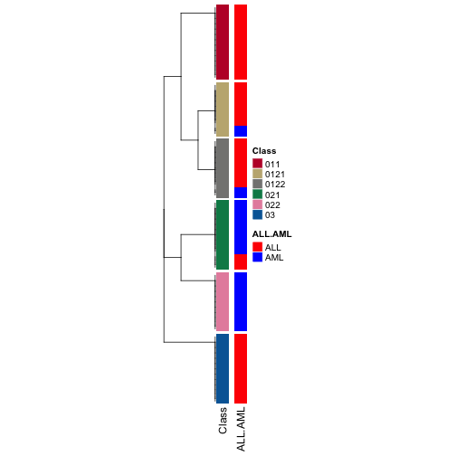
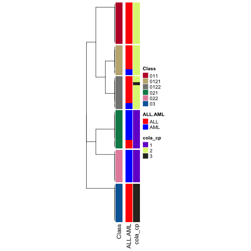
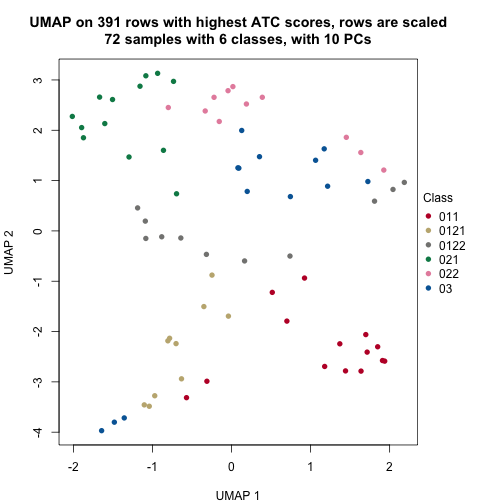

Hierarchical Consensus Partitioning
=============================================================

**Author**: Zuguang Gu ( z.gu@dkfz.de )

**Date**: 2021-09-16

**Package version**: 1.9.4

-------------------------------------------------------------


## The problem

Choosing the best k (number of partitions) is not an easy problem for
consensus partitioning. In consensus partitioning, various metrics based on
the consensus matrix are normally calculated, _e.g._ PAC scores (or 1-PAC) or
mean silhouette scores, and the best k is normally selected based on the
"extremal method", _i.e._ to select the k that corresponds to the highest or
lowest values of the metrics. When the number of partitions is small, it is
relatively easy to determine the best k with high confidence, while when the
real number of clusters gets very large, it is difficult to identify the
correct or approximate k for several reasons, some of which we list in the
following: 1) Variation in the "big clusters" affect the eCDF of the consensus
matrix stronger than variation in the "small clusters", this can strongly
affect PAC scores. 2) Groups showing weaker differences (we can call them
secondary groups) are more difficult to separate especially when there are
already other groups showing distinct differences (we can call them major
groups). 3) The curve of various metrics against k gets flattened for large k
and the value of k with the extremal values will be less distinct.

The following four figures illustrate the eCDF curves of a consensus matrix,
1-PAC, mean silhouette and concordance scores for different k where k ranges
from 2 to 10 (from the analysis [here](
https://jokergoo.github.io/cola_examples/GBM_450K/GBM_450K_cgi_all_subgroup_cola_report/cola_report.html#MAD-pam)).
Basically, when k >= 5, the eCDF curves have a long plateau with less and less
curvature, _i.e._ they lose their step-like shape, which results in 1-PAC
getting almost stable for k >= 5. Also for the curves of mean silhouette and
concordance scores against k, they are almost flattened for k >= 3. If using
the "extremal method", k = 6 is taken as the best k because 1-PAC selects k =
9 while mean silhouette and concordance select k = 6.


When inspecting the consensus heatmaps for different k (_cf._ heatmaps below),
actually it is difficult to assess whether the partitioning for k = 6 is
better than any other k in [5, 10].


The problems of the "big clusters / small clusters" or "major clusters /
secondary clusters" in selecting the best k are mainly due to the consensus
partitioning procedure that all samples are taken into account equally. From
version 2.0.0, we proposed a new method which tries to solve this issue by
applying consensus partitioning in a hierarchical way. Simply speaking, one
could first classify the samples into n<sub>major</sub> groups
(n<sub>major</sub> is a small number, major clusters), then for each subgroup
of samples, one could repeatedly apply consensus clustering. By this means,
theoretically, small clusters or secondary clusters could be detected in later
steps of the hierarchical procedure.

## The workflow

The figure below illustrates the workflow of the hierarchical consensus partitioning.


The steps are:

1. The input matrix _M_ is treated as the top node in the hierarchy, with a
   node label "0".
2. Apply multiple combinations of top-value methods and partitioning methods
   on the matrix with a small set of k (_e.g._, 2-4).
3. Select the consensus partitioning result (_i.e._ with a specific top-value
   method and a partitioning method) which shows the highest mean silhouette scores with
   its best k. This consensus partitioning is treated as the partitioning on
   the node.
4. If this partitioning is not stable (_e.g._, mean silhouette < 0.9), the hierarchical
   partitioning stops and the columns of the matrix are treated as a subgroup.
5. If the number of signatures or the fraction of signatures to the total
   number of rows in the matrix is too small, it means the partitioning does
   not show biological meaningful results and the hierarchical partitioning
   stops. The columns are treated as a subgroup.
6. If the partioning passes the filtering on step 4 and 5, each subgroup is treated 
   a child node of the current node.
7. For each submatrix, if the number of columns is too small, the hierarchical
   partitioning stops and the set of columns is treated as a subgroup.
8. If the submatrix has enough columns, go to step 2 to perform consensus
   partioning recursively.

The process of the hierarchical consensus partitioning is saved as a
dendrogram internally.

## The usage

In this section, we demonstrate the functionalities of hierarchical consensus
partitioning. The design of these new functionalities tries to be as
consistent as the functions for normal consensus partitioning in **cola**,
_i.e._, the function `consensus_partition()` or
`run_all_consensus_partition_methods()`. Thus, you may find many functions
having the same names as the functions for normal consensus partitioning.

The following code applies hierarchical consensus partitioning on the Golub
dataset. Function `hierarchical_partition()` applies the analysis where the
main arguments are very similar as in `consensus_partition()` or
`run_all_consensus_partition_methods()`, which are the input matrix, the
sample annotations and the number of cores. The function returns a
`HierarchicalPartition` object.


```r
library(golubEsets)  # from Bioconductor
data(Golub_Merge)
m = exprs(Golub_Merge)
colnames(m) = paste0("sample_", colnames(m))
anno = pData(Golub_Merge)

m[m <= 1] = NA
m = log10(m)

m = adjust_matrix(m)

# apply quantile normalization
library(preprocessCore)  # from Bioconductor
cn = colnames(m)
rn = rownames(m)
m = normalize.quantiles(m)
colnames(m) = cn
rownames(m) = rn

set.seed(123)
golub_cola_rh = hierarchical_partition(
    m, anno = anno[, c("ALL.AML"), drop = FALSE]
)
```

Some important arguments in `hierarchical_partition()` are listed as follows:

- `top_n`: Number of rows with top values. The value can be a vector of
  integers. On each node, there is an additional filtering on rows of the
  submatrices to remove those rows with very small variances, which results in
  the reducing number of rows in the submatrices. Here `top_n` can be set as a
  vector of values less than 1 which are treated as the fraction of rows of
  every submatrix.
- `top_value_method`: A single or a vector of top-value methods.
- `partition_method`: A single or a vector of partitioning methods. All
  combinations of `top_value_method` and `partition_method` are tried.
- `combination_method`: Instead of specifying `top_value_method` and
  `partition_method`, all methods that are going to be tried can also be
  specified with `combination_method`. The value can be a vector in a form of
  `c("SD:hclust", "ATC:skmeans", ...)` or a data frame with two columns
  `data.frame(c("SD", "ATC"), c("hclust", "skmeans"))`.
- `anno`: Annotation for the columns. The value can be a vector or a data
  frame. Note the rows in `anno` should be corresponded to the matrix columns.
- `anno_col`: Colors for annotations. The value should be a list of colors
  where a named vector for discrete color mapping and a color mapping function
  generated by `circlize::colorRamp2()` for continuous color mapping.
- `mean_silhouette_cutoff`: Cut off for mean silhouette_cutoff score to decide whether a partition
  is stable and to be split further more.
- `min_samples`: Miminal number of samples to perform partitioning.
- `subset`: Number of subset columns to perform partitioning. If the current
  number of columns in the submatrix is higher than `subset`,
  `consensus_partition_by_down_sampling()` instead of `consensus_partition()`
  will be applied. It will be discussed in more details in the Section [**Work
  with huge datasets**](hierarchical.html#toc_5).
- `min_n_signatures`: On each node that has a partition, `get_signatures()` is
  applied to find the number of signatures under the best k. If the number of
  signatures is less than `min_n_signatures`, it means the partitioning might
  not be significantly different and the hierarchical consensus partitioning
  stops.
- `min_p_signatures`: This is the fraction of signatures to the total number
  of rows of the original matrix. This filtering is a companion of
  `min_n_signatures`.
- `max_k`: Maximal number of groups to try for consensus partitioning.
  Normally this value should be set to a small value, because more subgroups
  will be found during the hierarchical consensus partitioning process.
- `cores`: `hierarchical_partition()` supports parallel computing. This is
  the number of cores to use.

The object `golub_cola_rh` is already generated and shipped in **cola** package, so we directly load it.


```r
data(golub_cola_rh)
golub_cola_rh
```

```
## A 'HierarchicalPartition' object with 'ATC:skmeans' method.
##   On a matrix with 4116 rows and 72 columns.
##   Performed in total 1500 partitions.
##   There are 6 groups under the following parameters:
##     - min_samples: 6
##     - mean_silhouette_cutoff: 0.9
##     - min_n_signatures: 102.05 (signatures are selected based on:)
##       - fdr_cutoff: 0.05
##       - group_diff (scaled values): 0.5
## 
## Hierarchy of the partition:
##   0, 72 cols, 2041 signatures
##   |-- 01, 35 cols, 263 signatures
##   |   |-- 011, 14 cols, 11 signatures (c)
##   |   `-- 012, 21 cols, 174 signatures
##   |       |-- 0121, 10 cols (b)
##   |       `-- 0122, 11 cols (b)
##   |-- 02, 24 cols, 134 signatures
##   |   |-- 021, 13 cols, 35 signatures (c)
##   |   `-- 022, 11 cols (b)
##   `-- 03, 13 cols (a)
## Stop reason:
##   a) Mean silhouette score was too small
##   b) Subgroup had too few columns.
##   c) There were too few signatures.
## 
## Following methods can be applied to this 'HierarchicalPartition' object:
##  [1] "all_leaves"            "all_nodes"             "cola_report"           "collect_classes"      
##  [5] "colnames"              "compare_signatures"    "dimension_reduction"   "functional_enrichment"
##  [9] "get_anno"              "get_anno_col"          "get_children_nodes"    "get_classes"          
## [13] "get_matrix"            "get_signatures"        "is_leaf_node"          "max_depth"            
## [17] "merge_node"            "ncol"                  "node_info"             "node_level"           
## [21] "nrow"                  "rownames"              "show"                  "split_node"           
## [25] "suggest_best_k"        "test_to_known_factors" "top_rows_heatmap"      "top_rows_overlap"     
## 
## You can get result for a single node by e.g. object["01"]
```

Directly entering `golub_cola_rh` prints the hierarchy. As you already see in
the previous output, the node in the hierarchy is encoded in a special way. As
explained in previous text, on each node, the columns are split into several
groups and a digit (the subgroup index in current partitioning) is appended with the current node label to the
children node labels. Thus, the length (or `nchar`) of the label represents
the depth of that node in the hierarchy and from the node label, it is also
straightforward to infer its parent node. _E.g._, a node with label `0123` has its
parent node `012`.

Also you can find the functions that can be applied to the `HierarchicalPartition` object
in previous output.

The first function you may try is to see how the columns are separated and the hierarchy
of the subgroups. This can be done by `collect_classes()` function:


```r
collect_classes(golub_cola_rh)
```



There are several metrics saved for each node which can be retrieved by `node_info()`.


```r
node_info(golub_cola_rh)
```

```
##      id best_method depth best_k n_columns n_signatures p_signatures is_leaf
## 1     0 ATC:skmeans     1      3        72         2041  0.495869776   FALSE
## 2    01 ATC:skmeans     2      2        35          263  0.063896987   FALSE
## 3   011 ATC:skmeans     3      2        14           11  0.002672498    TRUE
## 4   012 ATC:skmeans     3      2        21          174  0.042274052   FALSE
## 5  0121 not applied     4     NA        10           NA           NA    TRUE
## 6  0122 not applied     4     NA        11           NA           NA    TRUE
## 7    02 ATC:skmeans     2      2        24          134  0.032555879   FALSE
## 8   021 ATC:skmeans     3      2        13           35  0.008503401    TRUE
## 9   022 not applied     3     NA        11           NA           NA    TRUE
## 10   03 ATC:skmeans     2      2        13           NA           NA    TRUE
```

There are following columns from `node_info()`:

- `id`: The node id or label.
- `best_method`: Because on each node, multiple methods set in `combination_method` are tried
   and the method that gives the highest 1-PAC under its best k is finally selected. The best
    method is saved here.
- `depth`: The depth of the node in the hierarchy.
- `best_k`: The best k used.
- `n_columns`: Number of columns of the submatrix.
- `n_signatures`: Number of signatures.
- `p_signatures`: Fraction of signatures to the total number of rows of the matrix.
- `is_leaf`: Whether the node is a leaf node.

These values are useful to merge the children nodes.

Most functions for dealing with the `HierarchicalPartition` object accept a `merge_node` argument,
where you can set different paremeters to select the children node to merge. These parameters
should be set by the function `merge_node_param()` function. And there are the four parameters
can be adjusted:

- `depth`
- `min_n_signatures`
- `min_p_signatures`

`min_n_signatures` measures how much you trust the classification on the bioloigcal point of view.
In the following, we demonstrate to manuplate the dendrogram by
setting different `min_n_signatures` values.


```r
collect_classes(golub_cola_rh, merge_node = merge_node_param(min_n_signatures = 174))
collect_classes(golub_cola_rh, merge_node = merge_node_param(min_n_signatures = 263))
collect_classes(golub_cola_rh, merge_node = merge_node_param(min_n_signatures = 2041))
```


We can also compare to the normal consensus partitioning classification:


```r
data(golub_cola)
golub_cola_cp = golub_cola["ATC:skmeans"]
collect_classes(golub_cola_rh, 
	anno = cbind(get_anno(golub_cola_rh), 
		cola_cp = factor(get_classes(golub_cola_cp, k = suggest_best_k(golub_cola_cp))[, "class"])),
	anno_col = c(get_anno_col(golub_cola_rh))
)
```



`get_classes()` returns the subgroups of columns:


```r
get_classes(golub_cola_rh)
```

```
## sample_39 sample_40 sample_42 sample_47 sample_48 sample_49 sample_41 sample_43 sample_44 sample_45 
##      "03"      "03"    "0121"     "011"     "011"      "03"     "011"    "0122"    "0122"    "0122" 
## sample_46 sample_70 sample_71 sample_72 sample_68 sample_69 sample_67 sample_55 sample_56 sample_59 
##    "0122"    "0122"    "0121"    "0121"     "011"     "011"    "0121"      "03"      "03"    "0122" 
## sample_52 sample_53 sample_51 sample_50 sample_54 sample_57 sample_58 sample_60 sample_61 sample_65 
##     "022"     "021"     "021"     "021"    "0122"     "022"     "022"    "0122"     "022"     "022" 
## sample_66 sample_63 sample_64 sample_62  sample_1  sample_2  sample_3  sample_4  sample_5  sample_6 
##    "0121"     "022"     "022"     "022"      "03"    "0121"      "03"      "03"     "011"      "03" 
##  sample_7  sample_8  sample_9 sample_10 sample_11 sample_12 sample_13 sample_14 sample_15 sample_16 
##      "03"      "03"    "0121"    "0121"    "0121"     "021"     "011"     "011"     "011"     "011" 
## sample_17 sample_18 sample_19 sample_20 sample_21 sample_22 sample_23 sample_24 sample_25 sample_26 
##     "011"    "0122"    "0122"     "011"     "011"     "021"      "03"     "011"     "021"    "0122" 
## sample_27 sample_34 sample_35 sample_36 sample_37 sample_38 sample_28 sample_29 sample_30 sample_31 
##      "03"     "022"     "022"     "021"     "021"     "021"     "021"    "0121"     "021"     "022" 
## sample_32 sample_33 
##     "021"     "021"
```

Also you can control `merge_node` argument to decide on which level of hierarchy you want.


```r
get_classes(golub_cola_rh, merge_node = merge_node_param(min_n_signatures = 263))
```

```
## sample_39 sample_40 sample_42 sample_47 sample_48 sample_49 sample_41 sample_43 sample_44 sample_45 
##      "03"      "03"     "012"     "011"     "011"      "03"     "011"     "012"     "012"     "012" 
## sample_46 sample_70 sample_71 sample_72 sample_68 sample_69 sample_67 sample_55 sample_56 sample_59 
##     "012"     "012"     "012"     "012"     "011"     "011"     "012"      "03"      "03"     "012" 
## sample_52 sample_53 sample_51 sample_50 sample_54 sample_57 sample_58 sample_60 sample_61 sample_65 
##      "02"      "02"      "02"      "02"     "012"      "02"      "02"     "012"      "02"      "02" 
## sample_66 sample_63 sample_64 sample_62  sample_1  sample_2  sample_3  sample_4  sample_5  sample_6 
##     "012"      "02"      "02"      "02"      "03"     "012"      "03"      "03"     "011"      "03" 
##  sample_7  sample_8  sample_9 sample_10 sample_11 sample_12 sample_13 sample_14 sample_15 sample_16 
##      "03"      "03"     "012"     "012"     "012"      "02"     "011"     "011"     "011"     "011" 
## sample_17 sample_18 sample_19 sample_20 sample_21 sample_22 sample_23 sample_24 sample_25 sample_26 
##     "011"     "012"     "012"     "011"     "011"      "02"      "03"     "011"      "02"     "012" 
## sample_27 sample_34 sample_35 sample_36 sample_37 sample_38 sample_28 sample_29 sample_30 sample_31 
##      "03"      "02"      "02"      "02"      "02"      "02"      "02"     "012"      "02"      "02" 
## sample_32 sample_33 
##      "02"      "02"
```

`suggest_best_k()` extracts the the best k as well as related metrics for the
best partitions on each node.


```r
suggest_best_k(golub_cola_rh)
```

```
##  node best_method is_leaf best_k 1-PAC mean_silhouette concordance n_sample   
##     0 ATC:skmeans              3 1.000           0.979       0.990       72 **
##    01 ATC:skmeans              3 1.000           0.948       0.981       35 **
##   011 ATC:skmeans    ✓(c)      2 0.857           0.964       0.984       14   
##   012 ATC:skmeans              2 1.000           1.000       1.000       21 **
##  0121 not applied    ✓(b)     NA    NA              NA          NA       10   
##  0122 not applied    ✓(b)     NA    NA              NA          NA       11   
##    02 ATC:skmeans              4 0.922           0.889       0.938       24  *
##   021 ATC:skmeans    ✓(c)      2 0.846           0.904       0.966       13   
##   022 not applied    ✓(b)     NA    NA              NA          NA       11   
##    03 ATC:skmeans    ✓(a)      2 0.705           0.875       0.952       13   
## ---------------------------------------------------------------------------- 
## Stop reason:
##   a) Mean silhouette score was too small
##   b) Subgroup had too few columns.
##   c) There were too few signatures.
```

Another important function which gives a direct feeling of how the subgrouping look like
is to check the signatures that are significantly different between subgroups.
Similarly as normal consensus partitioning, we can use `get_signatures()` here.
The function basically applies `get_signatures,ConsesusPartition-method()` on the partition
on every node and collect all the signatures as the signatures of the hierarchical 
consensus partitioning.


```r
get_signatures(golub_cola_rh, verbose = FALSE)
```


Other useful functions are `dimension_reduction()`, `compare_signatures()` and
`test_to_known_factors()`. The usages are as follows:


```r
dimension_reduction(golub_cola_rh)
```

```
## use UMAP
```




```r
compare_signatures(golub_cola_rh)
```

```
## * 72/72 samples (in 3 classes) remain after filtering by silhouette (>= 0.5).
## * cache hash: 5bfd84e00412d36bf582ce68d200588f (seed 888).
## * calculating row difference between subgroups by Ftest.
## * split rows into 4 groups by k-means clustering.
## * 2041 signatures (49.6%) under fdr < 0.05, group_diff > 0.
## * 35/35 samples (in 2 classes) remain after filtering by silhouette (>= 0.5).
## * cache hash: ef154d2cc8dfcffe6399df89438a336f (seed 888).
## * calculating row difference between subgroups by Ftest.
## * split rows into 2 groups by k-means clustering.
## * 263 signatures (6.4%) under fdr < 0.05, group_diff > 0.
## * 21/21 samples (in 2 classes) remain after filtering by silhouette (>= 0.5).
## * cache hash: a6562db7adfed2559326c5b056afae57 (seed 888).
## * calculating row difference between subgroups by Ftest.
## * split rows into 2 groups by k-means clustering.
## * 174 signatures (4.2%) under fdr < 0.05, group_diff > 0.
## * 24/24 samples (in 2 classes) remain after filtering by silhouette (>= 0.5).
## * cache hash: e08c0bbd53687e1f3712a8c43df48e50 (seed 888).
## * calculating row difference between subgroups by Ftest.
## * split rows into 2 groups by k-means clustering.
## * 134 signatures (3.3%) under fdr < 0.05, group_diff > 0.
```


```r
test_to_known_factors(golub_cola_rh)
```

```
##            ALL.AML
## class 4.408747e-09
```

Note all these functions mentioned above allow the `merge_node` argument to adjust
the hierarchy.

## Automated reporting

One of the key advantage of **cola** package is it automates the complete analysis. 
There is also a `cola_report()` function for `HierarchicalPartition` class and it 
automates the complete analysis as well. Simply run:


```r
rh = hierarchical_partition(...)
cola_report(rh, output_dir = ...)
```

## Work with huge datasets

In the vignette ["Work with Big Datasets"](work_with_big_datasets.html), we introduced
a `DownSamplingConsensusPartition` class and its corresponding method `consensus_partition_by_down_sampling()`
which performs consensus partitioning on a randomly sampled subset of columns and predict the subgroup
labels for the remaining columns from the ... Here `hierarchical_partition()` also supports down sampling
which makes it possible to work on extremly large datasets.

The only thing for dealing with huge datasets is to set the `subset` argument.


```r
hierarchical_partition(..., subset = ...)
```

On each node, to consider the euqal sizes of groups, we first perform a fast k-means and random sample columns with 
different weight according to the size the groups.

## Session info


```r
sessionInfo()
```

```
## R version 4.1.0 (2021-05-18)
## Platform: x86_64-apple-darwin17.0 (64-bit)
## Running under: macOS Big Sur 10.16
## 
## Matrix products: default
## BLAS:   /Library/Frameworks/R.framework/Versions/4.1/Resources/lib/libRblas.dylib
## LAPACK: /Library/Frameworks/R.framework/Versions/4.1/Resources/lib/libRlapack.dylib
## 
## locale:
## [1] C/UTF-8/C/C/C/C
## 
## attached base packages:
## [1] grid      stats     graphics  grDevices utils     datasets  methods   base     
## 
## other attached packages:
## [1] cola_1.9.4           circlize_0.4.13      ComplexHeatmap_2.9.3 knitr_1.33          
## [5] markdown_1.1         rmarkdown_2.9        BiocManager_1.30.16  colorout_1.2-2      
## 
## loaded via a namespace (and not attached):
##   [1] colorspace_2.0-2       rjson_0.2.20           ellipsis_0.3.2         mclust_5.4.7          
##   [5] XVector_0.32.0         GlobalOptions_0.1.2    clue_0.3-59            bit64_4.0.5           
##   [9] AnnotationDbi_1.54.1   RSpectra_0.16-0        fansi_0.5.0            xml2_1.3.2            
##  [13] codetools_0.2-18       splines_4.1.0          doParallel_1.0.16      cachem_1.0.5          
##  [17] impute_1.66.0          polyclip_1.10-0        jsonlite_1.7.2         Cairo_1.5-12.2        
##  [21] umap_0.2.7.0           annotate_1.70.0        cluster_2.1.2          png_0.1-7             
##  [25] data.tree_1.0.0        compiler_4.1.0         httr_1.4.2             assertthat_0.2.1      
##  [29] Matrix_1.3-4           fastmap_1.1.0          htmltools_0.5.1.1      tools_4.1.0           
##  [33] gtable_0.3.0           glue_1.4.2             GenomeInfoDbData_1.2.6 dplyr_1.0.7           
##  [37] Rcpp_1.0.7             slam_0.1-48            Biobase_2.52.0         eulerr_6.1.0          
##  [41] jquerylib_0.1.4        vctrs_0.3.8            Biostrings_2.60.1      iterators_1.0.13      
##  [45] polylabelr_0.2.0       xfun_0.24              stringr_1.4.0          lifecycle_1.0.0       
##  [49] irlba_2.3.3            XML_3.99-0.6           dendextend_1.15.1      zlibbioc_1.38.0       
##  [53] scales_1.1.1           microbenchmark_1.4-7   parallel_4.1.0         RColorBrewer_1.1-2    
##  [57] memoise_2.0.0          reticulate_1.20        gridExtra_2.3          ggplot2_3.3.5         
##  [61] sass_0.4.0             stringi_1.6.2          RSQLite_2.2.7          highr_0.9             
##  [65] genefilter_1.74.0      S4Vectors_0.30.0       foreach_1.5.1          BiocGenerics_0.38.0   
##  [69] shape_1.4.6            GenomeInfoDb_1.28.0    rlang_0.4.11           pkgconfig_2.0.3       
##  [73] matrixStats_0.59.0     bitops_1.0-7           evaluate_0.14          lattice_0.20-44       
##  [77] purrr_0.3.4            bit_4.0.4              tidyselect_1.1.1       magrittr_2.0.1        
##  [81] R6_2.5.0               IRanges_2.26.0         magick_2.7.2           generics_0.1.0        
##  [85] DBI_1.1.1              pillar_1.6.1           survival_3.2-11        KEGGREST_1.32.0       
##  [89] RCurl_1.98-1.3         tibble_3.1.2           crayon_1.4.1           utf8_1.2.1            
##  [93] skmeans_0.2-13         viridis_0.6.1          GetoptLong_1.0.3       blob_1.2.1            
##  [97] digest_0.6.27          xtable_1.8-4           brew_1.0-6             openssl_1.4.4         
## [101] stats4_4.1.0           munsell_0.5.0          viridisLite_0.4.0      bslib_0.2.5.1         
## [105] askpass_1.1
```

