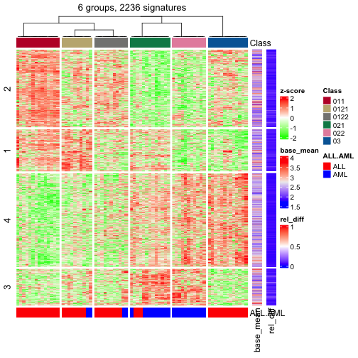

Work with Big Datasets
=============================================================

**Author**: Zuguang Gu ( z.gu@dkfz.de )

**Date**: 2021-07-14

**Package version**: 1.8.0

-------------------------------------------------------------


*cola* can be idealy applied to datasets with intermediate number of samples
(around 500), however, the running time and the memory usage might not be acceptable
if the number of samples gets very huge, e.g., more than thousands. Nevertheless,
we can propose the following two strategies to partially solve this problem.

1. A randomly sampled subset of samples which take relatively short running
   time (e.g., 100-200 samples) can be firstly applied with cola, from which a
   specific combination of top-value method and partitioning method that gives
   the best results can be pre-selected. Later user can only apply these two
   specific methods to the complete dataset. This would be much faster than
   blindly running cola with many methods in sequence.
2. The random subset of samples can be treated as a training set to generate a
   classification of cells. Then, the class labels of the remaining samples
   can be predicted, e.g. by testing the distance to the centroid of each cell
   group, without rerunning consensus partitioning on them. cola implements a
   `predict_classes()` function for this purpose (see the vignette ["Predict
   classes for new samples"](predict.html) for details). 

Note, since these two strategies are performed by sampling a small subset of
cells from the cohort, the cell clusters with small size might not be
detectable.

In the following examples, we use pseudo code to demonstrate the ideas. Assuming
the full matrix is in an object `mat`. We randomly sample 200 samples from it:


```r
ind = sample(ncol(mat), 200)
mat1 = mat[, ind]
```

**Strategy 1**. First we can apply cola on `mat1`:


```r
rl = run_all_consensus_partition_methods(mat1, ...)
cola_report(rl, ...)
```

Then find a best combination of top-value method and partitioining method.
Assuming they are saved in objects `tm` and `pm`. Next run
`consensus_partition()` on `mat` only with `tm` and `pm`:


```r
res = consensus_partition(mat, top_value_method = tm, partition_method = pm, ...)
```

**Strategy 2**. Similar as Strategy 1, we get the `ConsensusPartition` object
from methods `tm` and `pm`, which was applied on `mat1`:


```r
res = rl[tm, pm]
```

Note the consensus partition object `res` is only based on a subset of
original samples. With `res`, the classes of remaining samples can be
predicted:


```r
mat2 = mat[, setdiff(seq_len(ncol(mat)), ind)]
mat2 = t(scale(t(mat2)))
cl = predict_classes(res, mat2)
```

Please note, by default `mat1` is scaled in cola analysis, correspondingly, `mat2` should also be row-scaled.

You can also directly send `mat` to `predict_classes()` function:


```r
cl = predict_classes(res, t(scale(t(mat))))
```

## The `DownSamplingConsensusPartition` class

*cola* implements a new `DownSamplingConsensusPartition` class for
**Strategy 2** mentioned above. It runs consensus partitioning only on a
subset of samples and the classes of other samples are predicted by
`predict_classes()` internally. The `DownSamplingConsensusPartition` class
inherits the `ConsensusPartition` class, so the functions that can be applied
to the `ConsensusPartition` objects can also be applied to the
`DownSamplingConsensusPartition` objects, just with some tiny difference.

In the following example, we demonstrate the usage of
`DownSamplingConsensusPartition` class with the Golub dataset. Here the Golub
dataset was used to generate another data object `golub_cola` and we can
extract the matrix and the annotations by `get_matrix()` and `get_anno()`
functions.

To perform down sampling consensus partitioning, use the helper function
`consensus_partition_by_down_sampling()`. This function basically run
`consensus_partition()` on a subset of samples and later predict the classes
for all samples by `predict_classes()` function. Here we set `subset` argument
to 50, which means to randomly sample 50 samples from the whole dataset.


```r
data(golub_cola)
m = get_matrix(golub_cola)

set.seed(123)
golub_cola_ds = consensus_partition_by_down_sampling(m, subset = 50,
  anno = get_anno(golub_cola), anno_col = get_anno_col(golub_cola),
  top_value_method = "SD", partition_method = "kmeans")
```

The object `golub_cola_ds` is already shipped in the package. Simply load the data object.


```r
data(golub_cola_ds)
golub_cola_ds
```

```
## A 'DownSamplingConsensusPartition' object with k = 2, 3, 4, 5, 6.
##   On a matrix with 4116 rows and 50 columns, randomly sampled from 72 columns.
##   Top rows (412, 824, 1235) are extracted by 'ATC' method.
##   Subgroups are detected by 'skmeans' method.
##   Performed in total 750 partitions by row resampling.
##   Best k for subgroups seems to be 2.
## 
## Following methods can be applied to this 'DownSamplingConsensusPartition' object:
##  [1] "cola_report"             "collect_classes"         "collect_plots"          
##  [4] "collect_stats"           "colnames"                "compare_partitions"     
##  [7] "compare_signatures"      "consensus_heatmap"       "dimension_reduction"    
## [10] "functional_enrichment"   "get_anno"                "get_anno_col"           
## [13] "get_classes"             "get_consensus"           "get_matrix"             
## [16] "get_membership"          "get_param"               "get_signatures"         
## [19] "get_stats"               "is_best_k"               "is_stable_k"            
## [22] "membership_heatmap"      "ncol"                    "nrow"                   
## [25] "plot_ecdf"               "predict_classes"         "rownames"               
## [28] "select_partition_number" "show"                    "suggest_best_k"         
## [31] "test_to_known_factors"   "top_rows_heatmap"
```

The summary of the `golub_cola_ds` is very similar as the `ConsensusPartition` object, except that
it mentions the object is generated from 50 samples randomly sampled from 72 samples.

All the functions that are applied to the `ConsensusParition` class can be applied to the `DownSamplingConsensusPartition`
class, except some tiny differences.

`get_classes()` returns the predicted classes for _all_ samples:


```r
class = get_classes(golub_cola_ds, k = 2)
nrow(class)
```

```
## [1] 72
```

```r
class
```

```
##           class     p
## sample_39     2 0.000
## sample_40     2 0.000
## sample_42     1 0.000
## sample_47     1 0.000
## sample_48     1 0.000
## sample_49     2 0.000
## sample_41     1 0.000
## sample_43     1 0.000
## sample_44     1 0.000
## sample_45     1 0.000
## sample_46     1 0.000
## sample_70     1 0.000
## sample_71     1 0.000
## sample_72     1 0.000
## sample_68     1 0.000
## sample_69     1 0.000
## sample_67     1 0.000
## sample_55     2 0.000
## sample_56     2 0.000
## sample_59     1 0.276
## sample_52     2 0.000
## sample_53     2 0.000
## sample_51     2 0.000
## sample_50     2 0.000
## sample_54     1 0.000
## sample_57     2 0.000
## sample_58     2 0.000
## sample_60     2 0.000
## sample_61     2 0.000
## sample_65     2 0.000
## sample_66     1 0.000
## sample_63     2 0.000
## sample_64     2 0.000
## sample_62     2 0.000
## sample_1      2 0.000
## sample_2      1 0.000
## sample_3      2 0.000
## sample_4      2 0.000
## sample_5      1 0.000
## sample_6      2 0.000
## sample_7      2 0.000
## sample_8      2 0.000
## sample_9      1 0.000
## sample_10     2 0.916
## sample_11     1 0.000
## sample_12     2 0.000
## sample_13     1 0.000
## sample_14     1 0.000
## sample_15     1 0.000
## sample_16     1 0.000
## sample_17     1 0.000
## sample_18     2 0.000
## sample_19     1 0.000
## sample_20     1 0.000
## sample_21     1 0.000
## sample_22     2 0.000
## sample_23     2 0.000
## sample_24     1 0.000
## sample_25     2 0.000
## sample_26     1 0.000
## sample_27     2 0.000
## sample_34     2 0.000
## sample_35     2 0.000
## sample_36     2 0.000
## sample_37     2 0.000
## sample_38     2 0.000
## sample_28     2 0.000
## sample_29     1 0.000
## sample_30     2 0.000
## sample_31     2 0.000
## sample_32     2 0.000
## sample_33     2 0.000
```

There is an additional column named `p` which is the p-value for predicting the class labels. For more
details of how the p-value is calculated, please refer to the vignette ["Predict classes for new samples"](predict.html).

If the argument `k` is not specified or `k` is specified as a vector, the class labels for all `k` are returned.
Now you can set the `p_cutoff` argument so that the class label with p-value larger than this is set to `NA`.


```r
get_classes(golub_cola_ds, p_cutoff = 0.05)
```

```
##           k=2 k=3 k=4 k=5 k=6
## sample_39   2   3   3   3   3
## sample_40   2   3   3   3   3
## sample_42   1   1   1   1  NA
## sample_47   1   1   1   1   1
## sample_48   1   1   1   1   1
## sample_49   2   3   3   3   3
## sample_41   1   1   1   1   1
## sample_43   1   1   1   1   1
## sample_44   1   1   1   1   1
## sample_45   1   1   1   1   1
## sample_46   1   1   1   1   1
## sample_70   1   1   1   1   1
## sample_71   1   1  NA   4   4
## sample_72   1   1   1   4   4
## sample_68   1   1   1   1   1
## sample_69   1   1   1   1   1
## sample_67   1   1   1   4   4
## sample_55   2   3   3   3  NA
## sample_56   2   3   3   3   3
## sample_59  NA  NA  NA  NA   1
## sample_52   2   2   2   5   5
## sample_53   2   2   2   2   2
## sample_51   2   2   2   2   2
## sample_50   2   2   2   2   2
## sample_54   1   1  NA  NA   1
## sample_57   2   2   2  NA  NA
## sample_58   2   2   2  NA  NA
## sample_60   2   2   2   5  NA
## sample_61   2   2   2   2  NA
## sample_65   2   2   2   2  NA
## sample_66   1   1   1   1   1
## sample_63   2   2   2   5   5
## sample_64   2  NA   2  NA  NA
## sample_62   2   2   2   5   5
## sample_1    2   3   3   3  NA
## sample_2    1   1   1  NA  NA
## sample_3    2   3   3   3  NA
## sample_4    2   3   3   3  NA
## sample_5    1   1   1   1   1
## sample_6    2   3   3   3  NA
## sample_7    2   3   3   3   3
## sample_8    2   3   3   3   3
## sample_9    1   1   1   1   1
## sample_10  NA  NA  NA  NA   1
## sample_11   1   1   1   1  NA
## sample_12   2   2   2  NA  NA
## sample_13   1   1   1   1   1
## sample_14   1   1   1   1   1
## sample_15   1   1   1   1   1
## sample_16   1   1   1   1   1
## sample_17   1   1   1   1   1
## sample_18   2   3  NA  NA   1
## sample_19   1   1   1   1   1
## sample_20   1   1   1   1   1
## sample_21   1   1   1   1   1
## sample_22   2   3  NA  NA  NA
## sample_23   2   3   3   3   3
## sample_24   1   1   1   1   1
## sample_25   2  NA  NA  NA  NA
## sample_26   1   3  NA  NA  NA
## sample_27   2   3   3   3   3
## sample_34   2   2   2   2   2
## sample_35   2   2   2  NA  NA
## sample_36   2   2   2   2   2
## sample_37   2   2   2   2   2
## sample_38   2   2   2   2   2
## sample_28   2   2   2   2   2
## sample_29   1   1   1   1   1
## sample_30   2   2   2   2   2
## sample_31   2   2   2   2   2
## sample_32   2   2   2   2   2
## sample_33   2   2   2   2   2
```

There are several functions uses `p_cutoff` argument which controls the number
of "usable samples" or the samples with reliable classifications. These
functions are `get_classes()`, `test_to_known_factors()`,
`dimension_reduction()` and `get_signatures()`.

For `dimension_reduction()` function, the samples with p-value higher than
`p_cutoff` are marked by crosses. The samples that were not selected in the
random sampling were mapped with smaller dots.


```r
dimension_reduction(golub_cola_ds, k = 2)
```

```
## use UMAP
```



For `get_signatures()` function, the signatures are only found in the samples with p-values less than `p_cutoff`.


```r
get_signatures(golub_cola_ds, k = 2)
```

```
## * 70/72 samples (in 2 classes) remain after filtering by p-value (<= 0.05).
## * cache hash: d7ed9b16253695bd9adb86dbaa84b708 (seed 888).
## * calculating row difference between subgroups by Ftest.
## * split rows into 2 groups by k-means clustering.
## * 1847 signatures (44.9%) under fdr < 0.05, group_diff > 0.
## * making heatmaps for signatures.
```


## Session info


```r
sessionInfo()
```

```
## R version 4.1.0 (2021-05-18)
## Platform: x86_64-apple-darwin17.0 (64-bit)
## Running under: macOS Big Sur 10.16
## 
## Matrix products: default
## BLAS:   /Library/Frameworks/R.framework/Versions/4.1/Resources/lib/libRblas.dylib
## LAPACK: /Library/Frameworks/R.framework/Versions/4.1/Resources/lib/libRlapack.dylib
## 
## locale:
## [1] C/UTF-8/C/C/C/C
## 
## attached base packages:
##  [1] parallel  stats4    grid      stats     graphics  grDevices utils     datasets  methods  
## [10] base     
## 
## other attached packages:
##  [1] hu6800.db_3.13.0     org.Hs.eg.db_3.13.0  AnnotationDbi_1.54.1 IRanges_2.26.0      
##  [5] S4Vectors_0.30.0     Biobase_2.52.0       BiocGenerics_0.38.0  GetoptLong_1.0.5    
##  [9] mvtnorm_1.1-2        matrixStats_0.59.0   circlize_0.4.13      ComplexHeatmap_2.8.0
## [13] cola_1.8.0           markdown_1.1         knitr_1.33           BiocManager_1.30.16 
## [17] colorout_1.2-2      
## 
## loaded via a namespace (and not attached):
##  [1] colorspace_2.0-2       rjson_0.2.20           ellipsis_0.3.2         mclust_5.4.7          
##  [5] XVector_0.32.0         GlobalOptions_0.1.2    clue_0.3-59            bit64_4.0.5           
##  [9] RSpectra_0.16-0        fansi_0.5.0            xml2_1.3.2             codetools_0.2-18      
## [13] splines_4.1.0          doParallel_1.0.16      cachem_1.0.5           impute_1.66.0         
## [17] polyclip_1.10-0        jsonlite_1.7.2         Cairo_1.5-12.2         umap_0.2.7.0          
## [21] annotate_1.70.0        cluster_2.1.2          png_0.1-7              data.tree_1.0.0       
## [25] compiler_4.1.0         httr_1.4.2             assertthat_0.2.1       Matrix_1.3-4          
## [29] fastmap_1.1.0          tools_4.1.0            gtable_0.3.0           glue_1.4.2            
## [33] GenomeInfoDbData_1.2.6 dplyr_1.0.7            Rcpp_1.0.6             slam_0.1-48           
## [37] eulerr_6.1.0           vctrs_0.3.8            Biostrings_2.60.1      iterators_1.0.13      
## [41] polylabelr_0.2.0       xfun_0.24              stringr_1.4.0          mime_0.11             
## [45] lifecycle_1.0.0        irlba_2.3.3            XML_3.99-0.6           dendextend_1.15.1     
## [49] zlibbioc_1.38.0        scales_1.1.1           microbenchmark_1.4-7   RColorBrewer_1.1-2    
## [53] gridExtra_2.3          memoise_2.0.0          reticulate_1.20        ggplot2_3.3.5         
## [57] stringi_1.6.2          RSQLite_2.2.7          highr_0.9              genefilter_1.74.0     
## [61] foreach_1.5.1          shape_1.4.6            GenomeInfoDb_1.28.0    rlang_0.4.11          
## [65] pkgconfig_2.0.3        bitops_1.0-7           evaluate_0.14          lattice_0.20-44       
## [69] purrr_0.3.4            bit_4.0.4              tidyselect_1.1.1       magrittr_2.0.1        
## [73] R6_2.5.0               magick_2.7.2           generics_0.1.0         DBI_1.1.1             
## [77] pillar_1.6.1           survival_3.2-11        KEGGREST_1.32.0        RCurl_1.98-1.3        
## [81] tibble_3.1.2           crayon_1.4.1           utf8_1.2.1             viridis_0.6.1         
## [85] skmeans_0.2-13         blob_1.2.1             digest_0.6.27          xtable_1.8-4          
## [89] brew_1.0-6             openssl_1.4.4          munsell_0.5.0          viridisLite_0.4.0     
## [93] askpass_1.1
```

